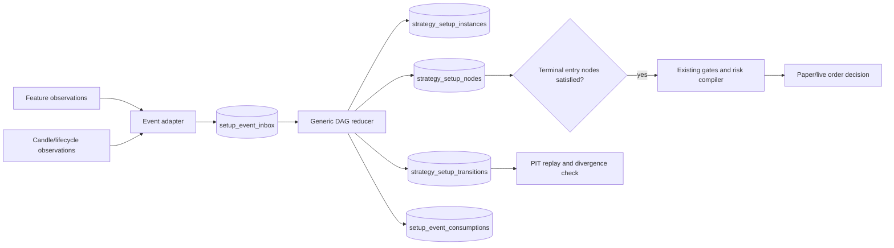

# Fix Plan — Progressive DAG Lifecycle

Date: 2026-07-23  
Status: implementation-ready proposal  
Chosen target: full generic DAG  
Rollout: shadow → replay comparison → canary → primary

## 1. Goal

Make every displayed and executable setup one causally ordered, durable, reproducible market hypothesis.

Target guarantees:

1. Every DAG dependency is enforced.
2. Temporal relation is explicit per edge.
3. Exact feature/object identity survives entire setup.
4. Setup state survives process and DB restarts.
5. Every transition and invalidation is immutable and auditable.
6. Live and PIT backtest use same pure reducer.
7. Progressive live orders remain disabled until acceptance gates pass.

This target means 90%+ confidence in setup construction integrity after measured validation. It does not imply 90% win probability.

## 2. Current components

### Reuse

- `packages/strategies/src/staged/reducer.ts`: pure reducer pattern, ordering guard, terminal-state guard, event idempotency concepts.
- `packages/strategies/src/staged/coordinator.ts`: expiry and multi-object coordination concepts.
- `packages/strategies/src/staged/planner.ts`: causal-role classification and fail-closed blockers.
- `packages/strategies/src/featureRegistry.ts`: feature semantic and lifecycle contracts.
- `packages/strategies/src/validate.ts`: DAG cycle/dangling-reference validation.
- Strategy/feature deployment snapshots in `apps/web/src/lib/pipelineTrigger.ts`.
- Signal fingerprints and transaction boundary in `packages/tradePipeline/src/liveRunner.ts`.
- Producer freshness infrastructure in shared/trade-pipeline packages.
- JSONL spool pattern in `scripts/candidate-audit-spool.js`.

### Replace or narrow

- `packages/strategies/src/compiler.ts::compileProgressiveSQL()`: retire as executable progressive lifecycle. Keep temporarily as legacy shadow comparator only.
- `setup_evaluations.setup_status`: stop treating evaluation cache as authoritative lifecycle.
- Process-memory `processedEventIds`: replace with DB uniqueness.
- Hard-coded `StagedEvent` union and fixed phases: generalize to compiled DAG contract and feature observations.

### Preserve unchanged

- Flat `setup[]` compiler for non-progressive point-in-time strategies.
- Existing risk compiler, gates, order executor, candle ingestion, feature producers.
- Live/PIT lifecycle asymmetry for mutable feature tables until canonical lifecycle-event ledger replaces it.

## 3. Target flow



## 4. Strategy contract v2

Modify `packages/shared/src/types/strategy.ts`.

### New types

```ts
type TemporalRelation = "as_of" | "after" | "within" | "overlaps";
type DependencyMode = "all" | "any" | "quorum";
type NodeKind = "context" | "object" | "event" | "confirmation" | "entry";
type ConsumptionPolicy = "exclusive_setup" | "shared_root" | "reusable";

interface ProgressiveDependency {
  stepId: string;
  relation: TemporalRelation;
  minDelayBars?: number;
  maxDelayBars?: number;
}

interface ProgressiveStepV2 {
  id: string;
  kind: NodeKind;
  feature: string;
  tf: TimeFrame;
  predicate: string;
  dependencies: ProgressiveDependency[];
  dependencyMode?: DependencyMode;
  quorum?: number;
  ttlBars?: number;
  rank?: { limit: number; orderBy: string };
  identityColumns?: string[];
  directionMap?: "same" | "opposite" | "liquidity_to_trade" | "none";
  consumption?: ConsumptionPolicy;
  terminal?: "entry_ready" | "invalidated";
  session?: string;
}
```

### Contract rules

- `progressiveVersion: 2` required for new engine.
- Root nodes have zero dependencies.
- Non-root nodes have one or more explicit dependencies.
- Every edge declares temporal relation.
- `within` requires `maxDelayBars`.
- `quorum` requires `1 <= quorum <= dependencies.length`.
- Every node declares identity columns or feature registry supplies them.
- Every object/event feature must have direction semantics in registry.
- At least one reachable `entry_ready` terminal node required.
- Every nonterminal node must reach terminal or invalidation policy.
- Rank expression must use allowlisted columns and directions; never raw SQL injection.
- Existing v1 `dependsOn`, `ttlMinutes`, `rankLimit`, `rankOrderBy` accepted only by migration adapter in shadow mode.

## 5. Compiled DAG plan

Add package files:

- `packages/strategies/src/progressive/types.ts`
- `packages/strategies/src/progressive/validator.ts`
- `packages/strategies/src/progressive/planner.ts`
- `packages/strategies/src/progressive/hash.ts`
- `packages/strategies/src/progressive/index.ts`

`compileProgressivePlan(spec)` returns immutable JSON, not whole-chain signal SQL:

- contract version
- strategy/spec/snapshot hash
- topological node order
- root nodes
- terminal nodes
- normalized edges
- allowlisted predicates
- identity projections
- ranking plans
- cancellation plan
- required feature watermarks

Plan hash becomes part of setup identity, transition fingerprint, candidate audit, live signal, and backtest result.

Keep `compileStrategy()` dispatch:

- flat spec: existing SQL compiler
- progressive v1 during migration: legacy SQL comparator only
- progressive v2: compiled DAG plan plus event discovery queries

## 6. Persistence model

Add next non-conflicting numbered migrations after current migration head. Do not reuse numbers.

### 6.1 `strategy_setup_instances`

One durable hypothesis instance.

Key columns:

- `id UUID PRIMARY KEY`
- `strategy_id`, `variant_id`, `family_id`
- `strategy_snapshot_id`, `deployment_id`
- `plan_hash`, `spec_hash`, `contract_version`
- `symbol`, `side`
- `root_fingerprint`
- `status`: `active|entry_ready|entered|completed|invalidated|expired|cancelled|error`
- `started_at`, `anchor_ts`, `expires_at`, `terminal_at`
- `terminal_reason`
- `revision BIGINT`
- `created_at`, `updated_at`

Constraints:

- terminal rows cannot return to active status; enforce through transition function and trigger/check where practical.
- unique root identity per strategy snapshot, symbol, side, and root fingerprint.
- indexes on active symbol/strategy and expiry.

### 6.2 `strategy_setup_nodes`

Current materialized node state per setup.

Key columns:

- `setup_instance_id`, `node_id` composite PK
- `status`: `waiting|satisfied|invalidated|expired|skipped`
- `event_ts`, `observed_at`
- `feature_table`, `feature_identity JSONB`
- `feature_fingerprint`
- `evidence_snapshot JSONB`
- `satisfied_dependencies JSONB`
- `expires_at`
- `revision`

Immutable evidence should be copied when node becomes satisfied. Later mutable feature updates cannot rewrite setup history.

### 6.3 `strategy_setup_transitions`

Append-only transition ledger.

Key columns:

- `id BIGSERIAL`
- `setup_instance_id`
- `node_id`
- `from_status`, `to_status`
- `event_id`, `event_ts`, `observed_at`
- `reason_code`
- `evidence_snapshot JSONB`
- `plan_hash`
- `transition_fingerprint`
- `source`: `live|shadow|backtest|replay`
- `created_at`

Unique `transition_fingerprint`. Block update/delete for runtime roles.

### 6.4 `setup_event_inbox`

Durable normalized event input.

Key columns:

- `event_id TEXT PRIMARY KEY`
- `symbol`, `feature_name`, `tf`
- `event_ts`, `observed_at`
- `feature_identity JSONB`
- `payload JSONB`
- `producer_run_id`
- `source_row_fingerprint`
- `processing_status`, `attempts`, `last_error`

Unique source-row fingerprint protects replay and worker retry.

### 6.5 `setup_event_consumptions`

Prevents cross-setup evidence recycling according to policy.

- `event_id`
- `setup_instance_id`
- `node_id`
- `policy`
- unique constraints for exclusive consumption

### 6.6 `setup_replay_runs` and `setup_replay_divergences`

Store replay window, code/plan hashes, transition counts, fingerprint mismatches, missing/extra transitions, and verdict.

### 6.7 Existing table relationship

- `setup_evaluations`: retain as setup-engine quality snapshot/cache; add nullable `setup_instance_id` and `transition_id`.
- `strategy_signal_candidates`: retain final candidate/gate audit; add `setup_instance_id`, `terminal_node_id`, `plan_hash`, `transition_fingerprint`.
- `live_signal` and `orders`: add `setup_instance_id` and unique one-order-per-setup policy where strategy requires it.
- Update `infra/db/relation-contract.yaml`, `infra/db/runtime-access-contract.json`, and migration protected-table list.

## 7. Generic reducer

Add:

- `packages/strategies/src/progressive/reducer.ts`
- `packages/strategies/src/progressive/dependencyEvaluator.ts`
- `packages/strategies/src/progressive/temporal.ts`
- `packages/strategies/src/progressive/direction.ts`
- `packages/strategies/src/progressive/ranking.ts`
- `packages/strategies/src/progressive/fingerprint.ts`

Pure reducer input:

- immutable compiled plan
- current setup instance and node states
- normalized event
- data-clock timestamp

Output:

- node transitions
- setup transition
- event consumptions
- emitted `entry_ready` candidate
- ignored/rejected reason

Rules:

1. Reject event timestamp older than required dependency anchor for `after`/`within`.
2. Evaluate all dependencies according to `all|any|quorum`.
3. Enforce min/max delay and node TTL.
4. Resolve direction through registry mapping.
5. Rank competing events deterministically.
6. Bind exact identity and immutable evidence once satisfied.
7. Apply invalidation to dependent descendants.
8. Never mutate terminal setup.
9. Make repeated event application produce no new transition.
10. Generate deterministic transition fingerprint from plan, setup, node, event, and target state.

DB transaction wrapper uses:

- advisory lock or `SELECT ... FOR UPDATE` per setup instance,
- expected `revision` compare,
- transition insert before materialized-state update,
- unique fingerprints as final idempotency guard.

## 8. Event adapters

Add under engine or strategies package:

- feature-row adapter
- candle-close adapter
- lifecycle-event adapter
- producer-watermark adapter

Feature registry gains:

- identity columns
- emitted event kind
- direction semantics
- lifecycle semantics
- dense/sparse classification
- event timestamp column
- invalidation event mapping

Do not poll every feature table independently per setup. Pipeline bucket should discover rows newer than per-source watermark, normalize once, write inbox, then process affected strategy plans.

## 9. Live integration

Modify `apps/web/src/lib/pipelineTrigger.ts`:

1. Run feature engine.
2. Validate producer readiness.
3. Normalize newly available events into inbox.
4. Run lifecycle worker for affected symbol under bounded budget.
5. Persist snapshot/deployment IDs.
6. In shadow mode, execute both:
   - legacy progressive SQL
   - DAG lifecycle reducer
7. Persist comparison result.
8. Only send DAG `entry_ready` candidate to existing live runner when deployment mode allows.

Modify `packages/tradePipeline/src/liveRunner.ts`:

- accept `setupInstanceId` and terminal transition evidence.
- reject progressive signal without durable setup and plan hash.
- include setup ID in fingerprint.
- enforce one-trade-per-setup.
- write candidate audit for no-entry and gate rejection paths.
- mark setup `entered` only in same DB transaction as durable order creation.

Modify `apps/web/src/lib/liveRunner.ts` and `scripts/dry-run-live.ts` signatures accordingly.

## 10. Worker and spool model

Add dedicated PM2 app, for example `tz-setup-lifecycle`, in `ecosystem.config.js`.

Worker responsibilities:

- drain `setup_event_inbox`
- expire active nodes/setups using data clock
- retry transient failures
- dead-letter deterministic failures
- publish transition metrics
- never place orders directly

Add dedicated candidate audit drain worker or invoke safe bounded drain from worker. Keep decision path non-blocking.

Health fields:

- inbox oldest age
- unprocessed count
- failed/dead-letter count
- active setup count
- overdue setup count
- transition lag
- candidate spool age/bytes
- replay divergence status

Fix `pipeline_health` by aggregating trigger state to one latest row per intended key before variant join.

## 11. PIT backtest and replay

Modify `scripts/backtest-pit-v2.js` in stages.

### Stage A

Add DAG shadow replay beside existing compiler. No trade result changes.

### Stage B

Use ordered normalized event stream and same reducer. Persist transition fingerprints and setup IDs. Existing risk/outcome engine starts only at `entry_ready`.

### Stage C

Make DAG replay primary for progressive v2. Keep legacy comparator behind explicit diagnostic flag, not normal execution flag.

Requirements:

- `observed_at`/availability ordering protects PIT.
- mutable lifecycle columns never define historical state directly.
- data clock drives expiry.
- same ranking and consumption policy as live.
- backtest output identifies setup and terminal transition.

Add separate replay command:

`node scripts/replay-progressive-setups.js <variant> <symbol> <start> <end> [--compare-live]`

## 12. Candidate audit completion

Modify:

- `packages/tradePipeline/src/candidateAudit.ts`
- `scripts/candidate-audit-spool.js`
- migration/table columns
- health endpoints

Record stages:

- `root_discovered`
- `node_waiting`
- `node_satisfied`
- `node_rejected`
- `setup_invalidated`
- `entry_ready`
- `gate_rejected`
- `executed`

Avoid row explosion by storing transitions in transition table; candidate audit can store evaluation summaries and final decisions. Transition ledger remains source of setup chronology.

## 13. Web/API and chart evidence

Add APIs:

- `GET /api/setups/[setupId]`
- `GET /api/setups/[setupId]/timeline`
- `GET /api/strategies/variants/[variantId]/setups`
- `GET /api/v2/pipeline/health` extended lifecycle fields

Modify likely UI touchpoints:

- `apps/web/src/components/analyze/SetupCard.tsx`
- `apps/web/src/components/analyze/KlineChart.tsx`
- strategy detail/command-center components as needed

Chart must render exact persisted node evidence, not rerun feature lookup. Show:

- setup ID and plan hash
- node timeline
- exact feature IDs
- causal arrows/dependencies
- active/expired/invalidation state
- data freshness
- shadow/replay parity

Mark setup `UNVERIFIED` when transition evidence or producer readiness is missing.

## 14. Rollout flags

Add explicit settings:

- `TM_PROGRESSIVE_DAG_MODE=off|shadow|compare|canary|primary`
- `TM_PROGRESSIVE_DAG_VARIANTS=<csv>`
- `TM_PROGRESSIVE_CANARY_RISK_MULTIPLIER`
- `TM_PROGRESSIVE_WORKER_ENABLED`
- `TM_PROGRESSIVE_REPLAY_REQUIRED=true`

Mode semantics:

- `off`: flat and legacy behavior only.
- `shadow`: DAG writes state/audit, never sends entry candidate.
- `compare`: DAG and legacy outputs compared, no DAG orders.
- `canary`: allowlisted variants/symbols, tiny risk, hard health/replay gates.
- `primary`: DAG drives progressive execution; legacy comparator disabled or sampled.

Fail closed for progressive orders if worker, producer, audit, or plan snapshot unhealthy.

## 15. Implementation phases

### Phase 0 — Containment and truth

Files:

- `packages/strategies/src/validate.ts`
- `apps/web/src/lib/pipelineTrigger.ts`
- `scripts/candidate-audit-spool.js`
- `ecosystem.config.js`
- new health migration

Tasks:

1. Force existing progressive live variants to shadow/compare.
2. Reject malformed non-array `steps` at seed/load boundaries.
3. Wire candidate audit drain and expose lag.
4. Fix duplicate pipeline health rows.
5. Add required producer hard gate for DAG shadow creation.

Exit: no progressive order can bypass containment; candidate audit DB advances.

### Phase 1 — Contract and planner

Tasks:

1. Add v2 types and strict validator.
2. Add safe predicate/rank allowlisting.
3. Build normalized DAG plan and hash.
4. Add v1-to-v2 migration diagnostics, not silent conversion.
5. Update seed script to persist contract/plan hashes.

Exit: every progressive spec either compiles to deterministic plan or fails with precise errors.

### Phase 2 — Persistence and reducer

Tasks:

1. Add tables, constraints, roles, relation contract.
2. Implement pure reducer and dependency evaluator.
3. Add transactional repository.
4. Add event adapters and inbox.
5. Add expiry/invalidation processing.

Exit: deterministic replay from fixture events creates exact expected transition ledger.

### Phase 3 — Shadow live integration

Tasks:

1. Integrate event capture after feature engine.
2. Add lifecycle worker.
3. Persist deployment/snapshot provenance.
4. Run legacy and DAG side by side.
5. Build divergence report.

Exit: at least 30 tradable days or 200 progressive setup roots in shadow; no lost or duplicate transitions.

### Phase 4 — Backtest unification

Tasks:

1. Replay same event adapters and reducer in PIT.
2. Link trades to setup/transition IDs.
3. Compare live shadow with replay.
4. Remove progressive SQL from primary backtest path.

Exit: transition fingerprint parity at least 99.9%; every mismatch classified.

### Phase 5 — Canary

Tasks:

1. One variant, one symbol, paper first.
2. Tiny-risk live canary after paper acceptance.
3. Hard gates on producer, worker, audit, and replay health.
4. Automatic downgrade to shadow on breach.

Exit: agreed canary sample, zero unexplained lifecycle defects, risk metrics within limit.

### Phase 6 — Primary and cleanup

Tasks:

1. Promote allowlisted progressive variants.
2. Archive v1 compiler behavior and wrong-semantic tests.
3. Remove unused lifecycle claims from `setup_evaluations`.
4. Keep rollback to shadow, not rollback to wrong live semantics.

## 16. Test plan

### Unit

- DAG cycles, dangling edges, unreachable terminals.
- `all|any|quorum` dependency behavior.
- every temporal relation and boundary.
- direction mapping.
- ranking determinism.
- terminal immutability.
- duplicate/out-of-order events.
- invalidation propagation.

### DB integration

- concurrent workers create one transition.
- replay same inbox creates zero duplicates.
- one-trade-per-setup constraint.
- append-only transition permissions.
- expiry uses data clock.
- migration preserves existing tables/data.

### Adversarial causality

- child before parent rejected.
- confirmation before sweep rejected.
- event from different root rejected.
- event outside max delay rejected.
- invalidated object cannot satisfy descendant.
- one exclusive event cannot satisfy unrelated setup.
- multi-parent node waits for required dependency mode.
- future lifecycle mutation does not change replay.

### End-to-end

- DB outage spools audit/events and resumes idempotently.
- web/process restart resumes active setups.
- live shadow and PIT replay fingerprints match.
- chart evidence matches persisted transitions exactly.
- worker lag forces progressive fail-closed behavior.

Commands expected during implementation:

- `pnpm --filter @tm/strategies test`
- `pnpm --filter @tm/shared test`
- `pnpm --filter @tm/trade-pipeline test`
- `pnpm test`
- `pnpm -r build`
- `pnpm db:seed:check`

## 17. Acceptance gates

Engineering integrity:

- 100% child-after-parent compliance where edge requires it.
- 100% declared dependency enforcement.
- 100% transition rows linked to plan and strategy snapshots.
- 0 duplicate transition fingerprints.
- 0 terminal-state reopenings.
- 0 orders without setup instance and entry-ready transition.
- 0 unexplained event consumption conflicts.
- candidate/audit lag under five minutes.
- transition worker lag under one pipeline bucket.
- live/replay fingerprint parity at least 99.9%.
- all remaining divergence classified and non-trading-impacting.

Trader-facing integrity:

- every drawing resolves to persisted feature identity.
- chart chronology equals transition chronology.
- invalidation and expiry visible.
- stale producer or incomplete evidence displays `UNVERIFIED`.

Statistical strategy validation remains separate: out-of-sample expectancy, drawdown, regime stability, and forward results determine whether valid setups deserve capital.

## 18. Main risks and controls

| Risk | Control |
|---|---|
| Full DAG becomes overengineered | Versioned contract, narrow relation/dependency enums, no arbitrary plugin execution |
| Event volume grows too large | Normalize once, index watermarks, partition inbox/transitions, summarize audits |
| Two workers race | Per-setup lock, revision compare, unique transition fingerprint |
| Mutable features rewrite history | Immutable node evidence snapshot |
| Live/backtest adapter drift | One adapter library and contract tests |
| Predicate/rank SQL injection | Parser/allowlist; no raw runtime expressions |
| Migration changes active behavior | Shadow-only initial deployment |
| Worker outage loses setup events | Durable inbox and idempotent replay |
| Event shared across wrong setups | Explicit consumption policy/table |
| Old specs silently change meaning | `progressiveVersion`, migration report, separate plan hash |

## 19. First implementation slice

Start with vertical shadow slice, not all features:

1. One strategy: `smc_ict_liquidity_reversal` or selected active progressive variant.
2. One symbol: XAUUSD.
3. Nodes: context → zone/value object → sweep → structure/displacement → entry-ready.
4. Tables: instances, nodes, transitions, inbox.
5. Reducer: `all`, `as_of`, `after`, `within` only.
6. No live orders.
7. Chart/API reads persisted timeline.
8. PIT replay compares transition fingerprints.

After slice reaches parity and produces professionally coherent charts, generalize feature adapters and dependency modes.

## 20. Definition of done

Progressive fix is done when software can answer, from immutable records:

- Which exact hypothesis created this setup?
- Which exact market objects belong to it?
- Did every event occur after required parents?
- Were all DAG dependencies satisfied?
- What invalidates or expires it?
- Did live and PIT replay produce same transitions?
- Did displayed chart use exact persisted evidence?
- Could restart, retry, or concurrent execution duplicate or rewrite it?

Any unanswered question means setup remains shadow-only.
