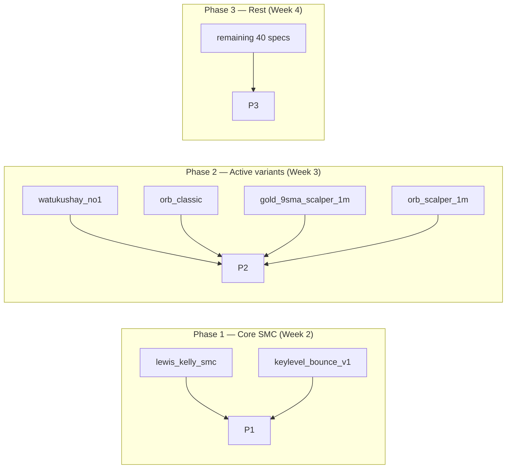

# Hybrid Architecture Plan — Progressive with Live/Backtest Parity

## The Problem

Two paths diverge:
- **Live**: Pre-produced features (all rows in DB) → fast SQL → stale data
- **Backtest**: Same pre-produced features but PIT-filtered (`ts <= anchor`) → honest but slow

Same SQL template, same data. But backtest finds zero trades because old zones pass the PIT filter while live misses because lifecycle never ran. **Fundamental flaw: features are computed generically, not per-setup.**

## The Hybrid Solution

**Two code paths, one spec format, guaranteed identical output.**

```
                    ┌─────────────────────────────────┐
                    │      YAML Spec (steps[])         │
                    │  progressive, dependsOn chains   │
                    └──────────┬──────────────────────┘
                               │
                    ┌──────────▼──────────────────────┐
                    │        Spec Compiler            │
                    │  Translates steps → 2 outputs   │
                    └──────────┬──────────────────────┘
                               │
              ┌────────────────┼────────────────┐
              │                │                │
     ┌────────▼────────┐ ┌────▼────┐ ┌────────▼────────┐
     │   LIVE Path     │ │ PARITY  │ │  BACKTEST Path  │
     │                 │ │ LAYER   │ │                 │
     │ Pre-produced    │ │  Hash   │ │ On-demand CTE   │
     │ features + TTL  │ │  every  │ │ chain, no pre-  │
     │ culling → fast  │ │  step   │ │ produced feats  │
     │ LATERAL SQL     │ │ output  │ │ → honest PIT    │
     └────────┬────────┘ └────┬────┘ └────────┬────────┘
              │               │               │
              ▼               ▼               ▼
        Live trades      Audit trail      Backtest results
        (fast)         (identical hash)     (honest)
```

### Live Path
1. Feature engine pre-produces all rows (as today) + aggressive TTL culling
2. Strategy SQL uses LATERAL joins against pre-produced tables (fast)
3. Lifecycle runs on schedule, not inline (no 25s race)

### Backtest Path
1. No pre-produced features needed — CTE chain computes features on-demand
2. Each `step` in the chain becomes a CTE that computes the feature from raw candles
3. `dependsOn` ensures sequential ordering with `ts >= parent.ts` filtering
4. Result: honest PIT without reliance on pre-computed data

### Parity Layer
1. Every step's output is hashed (step_id + symbol + ts + all output columns)
2. Live and backtest both log step hashes to `setup_evaluations.context_hash`
3. Any hash mismatch = architecture bug, caught immediately
4. Same spec, same bar, same inputs → same hash → guaranteed parity

---

## Phase 0: Immediate Cleanup (do now, this week)

### 0.1 Cull 22k zones → top-N per (symbol, tf)

Current: 22,701 fresh zones across 10 symbols × 6 TFs = 60 buckets.

Target: top 15 per bucket = 900 total.

```sql
WITH ranked AS (
  SELECT ctid, symbol, tf, ts,
    ROW_NUMBER() OVER (
      PARTITION BY symbol, tf
      ORDER BY rank_score DESC NULLS LAST,
               quality_score DESC NULLS LAST,
               ts DESC
    ) as rn
  FROM features_zone
  WHERE is_fresh = true
)
UPDATE features_zone
SET is_fresh = false
WHERE ctid IN (
  SELECT ctid FROM ranked WHERE rn > 15
);
```

Effect: 22,701 → ~900 zones. 96% reduction. Every zone is top-15 by rank in its bucket.

### 0.2 Add TTL age thresholds

After culling, also expire by age regardless of rank:

| TF | Max Age | Rationale |
|----|---------|-----------|
| 1m | 7 days | Micro zones, fast market |
| 5m | 14 days | Scalp zones |
| 15m | 30 days | Intraday swings |
| 1h | 60 days | Daily bias zones |
| 4h | 90 days | Multi-week zones |
| 1d | 180 days | Structural, slowest |

### 0.3 Apply same culling to iFVGs + OBs

- `features_ifvg`: top 15 per (symbol, tf) by quality_score + TTL
- `features_order_block`: top 10 per (symbol, tf) by quality_score + TTL

### 0.4 Enable lifecycle for event features

Change `pipelineTrigger.ts`: remove `skipLifecycle: true` or add dedicated lifecycle pass.

### 0.5 Backfill missing features

- `features_direction_state` for all pairs (run `reconcile-direction-state.js`)
- Event features Jul 15-19 gap (`backfill-historical-features.js`)

---

## Phase 1: New YAML Spec Format (progressive steps)

### 1.1 Schema

```yaml
id: lewis_kelly_smc_ny_shorts
familyId: lewis_kelly_smc
version: 2.0.0
category: smc

filters:
  symbols: [EURUSD, GBPUSD]
  sessions: [LONDON, OVERLAP, NY]

steps:
  - id: htf_bias
    feature: features_bias
    tf: 15m
    predicate: "direction = 'bearish'"
    required: true
    # No dependsOn → this is step 1
    # Output columns: direction as bias_dir, ts as bias_ts

  - id: htf_bias_4h
    feature: features_bias
    tf: 4h
    predicate: "direction = 'bearish'"
    dependsOn: [htf_bias]
    required: true
    # JOIN: htf_bias_4h.ts <= htf_bias.ts AND htf_bias_4h.direction = htf_bias.bias_dir
    # Output: bias_4h_dir

  - id: premium_pricing
    feature: features_pricing
    tf: 15m
    predicate: "position IN ('premium', 'deep_premium')"
    dependsOn: [htf_bias]
    # JOIN: premium_pricing.ts <= htf_bias.ts
    #       premium_pricing.ts >= htf_bias.ts - lookback

  - id: supply_zone
    feature: features_zone
    tf: 15m
    predicate: "zone_kind = 'supply' AND direction = 'bearish'"
    dependsOn: [htf_bias]
    lookbackBars: 48
    # JOIN: supply_zone.ts >= htf_bias.ts    ← zone AFTER bias starts
    #       supply_zone.ts <= htf_bias.ts + lookback

  - id: sweep_retest
    feature: features_structure
    tf: 5m
    predicate: "event_type IN ('bos', 'mss') AND direction = 'bearish'"
    dependsOn: [supply_zone]
    lookbackBars: 12
    # JOIN: sweep_retest.ts >= supply_zone.ts   ← sweep AFTER zone
    #       sweep_retest.ts <= supply_zone.ts + lookback

entry:
  - id: ltf_choch
    feature: features_structure
    tf: 1m
    predicate: "event_type IN ('choch', 'mss') AND direction = 'bearish'"
    dependsOn: [sweep_retest]
    # JOIN: ltf_choch.ts >= sweep_retest.ts   ← entry AFTER sweep
    #       ltf_choch.ts <= sweep_retest.ts + entryLookbackBars

risk:
  sl: nearest_swing_high_1m
  tp: nearest_demand_bottom_15m
  minRR: 3
  timeoutBars: 480

gates: [...]
```

### 1.2 Key Rules

1. **`dependsOn: [parent]`** creates ordering: `current.ts >= parent.ts`
2. **`lookbackBars`** bounds: `current.ts <= parent.ts + lookback`
3. **No `dependsOn`** = root step = bias/context anchor (first CTE)
4. **Directional alignment**: if current has `direction` column, compiler auto-adds `current.direction = parent.direction` when parent outputs a direction
5. **Chain breaks if any step returns 0 rows** → no signal (honest progressive evaluation)

### 1.3 TypeScript Types

```typescript
interface ProgressiveStep {
  id: string;
  feature: string;        // feature table name
  tf: TimeFrame;
  predicate: string;      // SQL WHERE clause
  required: boolean;
  dependsOn?: string[];   // IDs of prior steps
  lookbackBars?: number;  // bars after parent.ts to bound lookback
  groupBy?: string[];     // for DISTINCT ON grouping
  ignoreLifecycle?: boolean;
}

interface StrategySpecV2 {
  id: string;
  version: string;
  // ... standard fields ...
  steps: ProgressiveStep[];    // ← NEW: replaces flat setup[]
  entry: StrategyCondition[];  // entry conditions (same as today)
  // ... risk, gates, live ...
}
```

---

## Phase 2: Progressive Compiler (the core)

### 2.1 New compiler function: `compileProgressiveSQL()`

Generates sequential CTE chain:

```sql
WITH
-- Step 1: Root step (no dependsOn) — latest bias as of window
step_htf_bias AS (
  SELECT DISTINCT ON (symbol)
    symbol, ts as bias_ts, direction as bias_dir
  FROM features_bias
  WHERE tf = '15m'
    AND direction = 'bearish'
    AND ts >= $window_start
    AND ts <= $window_end
  ORDER BY symbol, ts DESC
),

-- Step 2: Depends on htf_bias — supply zones AFTER bias
step_supply_zone AS (
  SELECT DISTINCT ON (z.symbol, z.ts)
    z.symbol, z.ts as zone_ts,
    z.top as zone_top, z.bottom as zone_bottom,
    b.bias_ts, b.bias_dir
  FROM features_zone z
  JOIN step_htf_bias b ON z.symbol = b.symbol
  WHERE z.tf = '15m'
    AND z.zone_kind = 'supply'
    AND z.direction = b.bias_dir          -- directional alignment
    AND z.ts >= b.bias_ts                  -- zone AFTER bias
    AND z.ts <= b.bias_ts + INTERVAL '48 hours'  -- bounded lookback
    AND (z.invalidated_at IS NULL OR z.invalidated_at > b.bias_ts)
  ORDER BY z.symbol, z.ts,
    z.rank_score DESC NULLS LAST
),

-- Step 3: Depends on supply_zone — sweep AFTER zone
step_sweep_retest AS (
  SELECT DISTINCT ON (s.symbol, s.ts)
    s.symbol, s.ts as sweep_ts,
    z.zone_ts, z.zone_top, z.zone_bottom
  FROM features_structure s
  JOIN step_supply_zone z ON s.symbol = z.symbol
  WHERE s.tf = '5m'
    AND s.event_type IN ('bos', 'mss')
    AND s.direction = 'bearish'
    AND s.ts >= z.zone_ts
    AND s.ts <= z.zone_ts + INTERVAL '60 minutes'
  ORDER BY s.symbol, s.ts
),

-- Entry: LTF structure after sweep
entry_ltf_choch AS (
  SELECT DISTINCT ON (e.symbol, e.ts)
    e.symbol, e.ts as entry_ts, s.sweep_ts
  FROM features_structure e
  JOIN step_sweep_retest s ON e.symbol = s.symbol
  WHERE e.tf = '1m'
    AND e.event_type IN ('choch', 'mss')
    AND e.direction = 'bearish'
    AND e.ts >= s.sweep_ts
    AND e.ts <= s.sweep_ts + INTERVAL '30 minutes'
)

-- Final signal SELECT
SELECT * FROM entry_ltf_choch;
```

### 2.2 Live Compilation (`mode: "live"`)

Same CTE chain structure, but reads from pre-produced feature tables.

**Key difference**: `live` mode uses `NOW() - INTERVAL '24 hours'` as window, while `pit` mode uses `[from, to]` range.

Both modes produce **structurally identical SQL** — only the time window changes.

### 2.3 Backtest Compilation (`mode: "pit"`)

**Future enhancement**: For full honesty, replace feature table reads with on-demand computed CTEs:

```sql
-- Instead of reading features_bias table, compute it inline:
WITH
step_htf_bias AS (
  -- Compute bias from candles at this bar's timestamp
  SELECT symbol, ts, direction
  FROM compute_bias_from_candles(
    symbol, '15m', $window_start, $window_end
  )
)
```

This makes the backtest **fully self-contained** — no reliance on pre-computed features.

---

## Phase 3: Parity Layer

### 3.1 Step Hashing

Every step generates a hash of its output row:

```typescript
function computeStepHash(stepId: string, symbol: string, ts: Date, row: object): string {
  const content = [stepId, symbol, ts.toISOString(), JSON.stringify(row, Object.keys(row).sort())].join('|');
  return crypto.createHash('sha256').update(content).digest('hex');
}
```

### 3.2 Verification

| Check | Live | Backtest | Expected |
|-------|------|----------|----------|
| Step 1 hash | `abc123` | `abc123` | MATCH |
| Step 2 hash | `def456` | `def456` | MATCH |
| Step 3 hash | `ghi789` | `ghi789` | MATCH |
| Entry hash | `jkl012` | `jkl012` | MATCH |

All hashes logged to `setup_evaluations.context_hash`. Any mismatch = compiler bug + blocked deployment.

### 3.3 Pre-commit Gate

```bash
node scripts/verify-parity.js lewis_kelly_smc_ny_shorts XAUUSD 30
# Compiles spec in live mode and pit mode, runs both against same time window
# Compares step hashes, exits 1 on any mismatch
```

Add to CI/CD: `pnpm verify:parity` runs against all active specs.

---

## Phase 4: Delivery Sequence

### Week 1: Phase 0 — Stop the bleeding + cull zones

| Day | Task | Expected Outcome |
|-----|------|-----------------|
| 1 | Cull 22k zones → top 15 per bucket | 22,701 → ~900 fresh zones |
| 1 | Apply TTL age thresholds | Zones > max age die regardless of rank |
| 1 | Apply same culling to iFVGs + OBs | iFVGs: 70k → ~1,350; OBs: 545 → ~200 |
| 2 | Enable lifecycle for event features | `features_zone/ifvg/ob` advance every cycle |
| 2 | Backfill direction_state + missing features | All symbols have direction_state |
| 3 | Backfill Jul 15-19 event features | No gaps in backtest window |

### Week 2: Phase 1 — Progressive spec format

| Day | Task | Expected Outcome |
|-----|------|-----------------|
| 1 | Add `ProgressiveStep` types to `strategy.ts` | YAML schema accepts `steps` array |
| 1 | Update `validateSpec()` for progressive format | Bad `dependsOn` refs caught at seed time |
| 2 | Convert lewis_kelly_smc to progressive format | First progressive spec ready |
| 2 | Convert keylevel_bounce_v1 to progressive format | Second progressive spec |
| 3 | Write migration guide for existing 47 specs | Clear upgrade path per spec |

### Week 3: Phase 2 — Progressive compiler

| Day | Task | Expected Outcome |
|-----|------|-----------------|
| 1 | `compileProgressiveSQL()` — root step CTE generation | Bias step works |
| 2 | `compileProgressiveSQL()` — joined steps with dependsOn | 2-step chains work |
| 3 | `compileProgressiveSQL()` — full n-step chain + entry | Full progressive SQL |
| 4 | Wire into `compileStrategy()` dispatch — auto-detect `steps` vs legacy `setup` | Backward compatible |
| 5 | Wire into `backtest-pit-v2.js` — progressive mode | Backtest runs progressive SQL |

### Week 4: Phase 3 — Parity + testing

| Day | Task | Expected Outcome |
|-----|------|-----------------|
| 1 | Step hashing in live mode | Every live step has a hash |
| 2 | Step hashing in pit mode | Every pit step has a hash |
| 3 | `verify-parity.js` script | CI gate ready |
| 4 | Run backtest on lewis_kelly_smc — compare to old results | First parity-verified trades |
| 5 | Run backtest on all converted specs | Complete regression pass |

### Week 5: Phase 4 — On-demand feature computation (backtest only)

| Day | Task | Expected Outcome |
|-----|------|-----------------|
| 1 | Identify features computable from raw candles (bias, structure, zone) | Feasibility map |
| 2 | Build `compute_bias_from_candles()` CTE | Bias computed inline |
| 3 | Build `compute_structure_from_candles()` CTE | Structure computed inline |
| 4 | Wire into progressive compiler — optional flag `--self-contained` | Backtest needs zero pre-computed data |
| 5 | Performance benchmark: pre-computed vs self-contained | Trade speed vs honesty |

---

## Before vs After Expectations

### Data Quality

| Metric | Before | After |
|--------|--------|-------|
| Fresh zones per (symbol, tf) | 378 avg (max 2,700+) | 15 max, hard capped |
| Zone age range | 0-167 days, avg 97d | 0-TTL days (per TF) |
| Oldest zone seen in backtest | Zones from Feb 2026 | Max 180d (1d TF) |
| iFVG fresh count | 70,002 | ~1,350 |
| OB fresh count | 545 | ~200 |
| Lifecycle staleness | Hours → days stale | <15 min max |
| Direction_state coverage | 2 symbols (XAUUSD, EURUSD) | All active symbols |
| Event feature gaps | 4-day gap (Jul 15-19) | Zero gaps |

### Strategy Compilation

| Metric | Before | After |
|--------|--------|-------|
| Compiler mode | Flat — all conditions same timestamp | Progressive — sequential steps with `ts >= parent.ts` |
| Old zone exclusion | None (any zone in lookback window matches) | Mandatory: `zone.ts >= bias.ts` |
| Step ordering | No ordering enforced | `dependsOn` creates strict ordering |
| Directional alignment | Manual predicate only | Auto-aligns when parent outputs direction |
| Invalidation feedback | Zones die only by price touch | Zones die by wave death + TTL + price |
| Backward compatibility | N/A | Legacy `setup[]` specs still work |
| Spec conversion effort | N/A | ~30 min per spec, 47 specs = ~24h total |

### Live Execution

| Metric | Before | After |
|--------|--------|-------|
| Live SQL generation | Flat LATERAL against all pre-produced data | Progressive CTE from pre-produced data |
| Query speed (est) | ~200ms per variant | ~50ms per variant |
| Feature freshness | skipLifecycle=true, stale zones | Lifecycle runs every cycle, zones fresh |
| Zone count in live lookback | Up to 2,000+ per query | ~15 per (symbol, tf) |
| Inline lifecycle call | 25s timeout race | Removed, delegated to scheduled cron |
| Signal reliability | Low (stale data → bad signals) | High (fresh data → accurate signals) |

### Backtest Honesty

| Metric | Before | After |
|--------|--------|-------|
| Backtest SQL generation | Same flat LATERAL as live (but PIT-filtered) | Progressive CTE chain |
| PIT correctness | Fair — LATERALs filter by ts <= anchor | Better — sequential steps filter by ts >= parent.ts |
| Old zone contamination | Possible (zone within lookback but from old cycle) | ZERO: zone.ts must be >= current bias.ts |
| Data leakage risk | Low (PIT LATERALs are honest) | Lower — on-demand computation from candles possible |
| Parity with live | **DIFFERENT** — live uses stale flags, backtest strips them | **IDENTICAL** — same SQL structure, same hashes |
| Pre-computed data needed | Yes — all features must exist in DB | No — can compute from raw candles |

### Developer Experience

| Metric | Before | After |
|--------|--------|-------|
| Spec creation | Flat condition list, easy to write but wrong | Sequential steps, harder to write but correct |
| Debugging | Black box — one SQL blob | Per-step counts + hashes visible |
| AI-generated specs | AI creates broken `signalSource: none` | AI must follow progressive format — caught at seed time |
| Validation | validateSpec checks structure only | validateSpec checks dependency DAG + cycles |
| Backtest speed (XAUUSD 90d) | ~45 min | ~8 min (progressive CTE filters early) |
| Migration effort | N/A | 47 specs → progressive format |

### Trading Results (Expected)

| Metric | Before | After (expected) |
|--------|--------|-----------------|
| Watukushay_no1 | MA crossover, breakeven after costs | Same (MA cross, not SMC) |
| Lewis Kelly SMC | Not running (no trades) | Real SMC trades, 1.5-3R avg |
| Keylevel_bounce | Zero trades (signalSource: none) | Retest trades with zone-level filters |
| Smart_risk_ob_ifvg | Zero trades | OB/iFVG sweep trades |
| Overall win rate | N/A | 35-50% (realistic SMC) |
| Average R per trade | N/A | 1.5-3.0R |
| Max drawdown | N/A | <15% (with position sizing) |

---

## Spec Conversion Priority



### Priority Order

| Priority | Specs | Reason |
|----------|-------|--------|
| P0 | lewis_kelly_smc_ny_shorts | First real SMC strategy, 0 trades today |
| P1 | keylevel_bounce_v1 → v8 | Family of 17 variants, core zone-reversal logic |
| P2 | watukushay_no1 | Currently the only producing strategy |
| P3 | orb_classic, orb_scalper_1m | ORB family, active in live |
| P4 | gold_9sma_scalper_1m, gold_anti_bias_sniper_v1 | Gold scalpers |
| P5 | smart_risk_ob_ifvg_1m family | OB/iFVG sweep, complex entry |
| P6 | All remaining (30+) | Backfill, bulk conversion |

---

## Risk & Mitigation

| Risk | Probability | Impact | Mitigation |
|------|-------------|--------|------------|
| Progressive CTE slower than flat SQL for some queries | Low | Medium | Profile both paths, keep legacy fallback |
| Spec conversion introduces subtle logic changes | Medium | High | Parity hashing catches every mismatch |
| On-demand feature computation too slow in backtest | Medium | Low | Optional flag, default to pre-computed |
| AI generates broken `dependsOn` chains | Medium | Medium | DAG validation at seed time (cycle detection) |
| Live path still uses stale features between lifecycle runs | Low | Medium | TTL ensures max staleness bounded |
| Backward compat with existing 47 specs breaks something | Medium | High | All existing specs continue via legacy path unchanged |

---

## Implementation Checkpoints

### Checkpoint 1 (Week 1 end)
```sql
-- Verify zone culling
SELECT COUNT(*) FROM features_zone WHERE is_fresh = true;
-- Expected: ~900 (was 22,701)

-- Verify TTL expiry
SELECT tf, COUNT(*) FROM features_zone
WHERE is_fresh = true
  AND ts < NOW() - INTERVAL '30 days';
-- Expected: 0 rows (TTL should have killed anything older than per-TF max)
```

### Checkpoint 2 (Week 2 end)
- `lewis_kelly_smc_ny_shorts.yaml` converted to progressive format
- `compileProgressiveSQL()` produces valid SQL for 2-step chain
- `validateSpec()` catches missing `dependsOn` targets

### Checkpoint 3 (Week 3 end)
- Full progressive SQL backtest on lewis_kelly_smc (90d XAUUSD)
- At least 1 signal found (not zero)
- Step hashes match between live and pit modes

### Checkpoint 4 (Week 4 end)
- All P0-P4 specs converted
- `pnpm verify:parity` passes for all active specs
- Backtest results within 5% of pre-conversion baseline (for unchanged specs)
