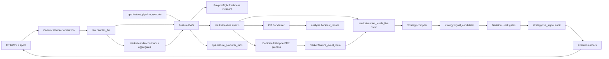

# Database Architecture Implementation Plan — 2026-07-17

## 1. Goal

Move `tradzfx_v2` from one superuser-owned public schema with overlapping historical relations into governed, least-privilege, domain-separated architecture without losing live trading, PIT correctness, candle history, feature lineage, or rollback ability.

This plan implements findings from:

- `reports/DATABASE_RELATION_PURPOSE_ACCESS_AUDIT_2026-07-17.md`
- `reports/DATABASE_KEY_ARCHITECTURE_AUDIT_2026-07-17.md`
- `AGENTS.md`

No destructive work starts from this document alone. Every destructive phase requires measured proof, backup, staging rehearsal, explicit acceptance, and repository migration guards.

## 2. Architecture principles

1. One canonical source per fact.
2. Similar domain does not mean same grain.
3. Immutable event formation separated from mutable current state.
4. Derived data must be reproducible from named sources and watermark.
5. Runtime processes never connect as owner or superuser.
6. Roles grant operations by process, not by developer convenience.
7. Public compatibility views preserve callers during schema migration.
8. PIT backtests never trust wall-clock current-state fields.
9. Live paths may read current-state projections where contract permits.
10. Backup, clean, old, and temporary tables never remain indefinitely in production schemas.
11. Every table has owner, producer, consumers, retention, recovery method, and deprecation state.
12. Schema and code contracts fail CI when they drift.
13. Feature-compute universe is explicit and independent from currently enabled strategy variants.
14. Every live producer has preflight and postflight freshness invariants tied to data clock.
15. Lifecycle refresh has a dedicated scheduled owner; inline refresh is bounded best-effort only.
16. Each symbol has one canonical candle source selected by governed broker arbitration.
17. `ON CONFLICT` enforces proven deterministic identity; it never defines identity by convenience.

## 3. Target architecture

### 3.1 Schemas

| Schema | Content | Owning runtime domain |
|---|---|---|
| `raw` | `candles_1m`, candle quality, ingest event ledger, terminal source state | Ingestion |
| `market` | Feature events, feature state, canonical candle/level views, market profiles | Engine and lifecycle |
| `strategy` | Families, variants, immutable snapshots, candidates, decisions | Strategy pipeline |
| `execution` | Orders, fills, position commands, terminal state, risk state | Execution |
| `analysis` | Backtest, calibration, analysis runs/signals/trades, narratives | Analysis workers |
| `ops` | Producer runs, jobs, checkpoints, pipeline state, health projections | Operations |
| `archive` | Time-limited migration snapshots with manifest and expiry | Owner only |
| `public` | Temporary compatibility views and approved API functions only | No tables after cutover |

Schema migration occurs through rename/move plus compatibility views. No big table copy unless physical redesign requires it.

### 3.2 Roles

| Role | Login | Responsibility |
|---|---:|---|
| `tradzfx_owner` | No | Own schemas, relations, types, functions |
| `tradzfx_migrator` | Yes, deploy-only | Apply migrations using controlled owner membership |
| `tradzfx_ingest` | Yes | Write raw candles/ingest state |
| `tradzfx_engine` | Yes | Read candles; write feature events/cache/producer ledger |
| `tradzfx_lifecycle` | Yes | Execute lifecycle/touch refresh procedures |
| `tradzfx_strategy` | Yes | Read canonical market data; write candidate/decision audit |
| `tradzfx_execution` | Yes | Manage approved orders, fills, commands, terminal/risk state |
| `tradzfx_web_read` | Yes | Read API-safe views |
| `tradzfx_web_command` | Yes | Execute bounded command procedures |
| `tradzfx_backtest` | Yes | Read PIT data; write analysis/backtest facts |
| `tradzfx_monitor` | Yes | Read health projections and permitted statistics |
| `tradzfx_maintenance` | Yes | Run exact retention/housekeeping mutations; no DDL |

Credentials stay outside repository. Every connection sets unique `application_name`. PM2 apps receive separate `DATABASE_URL` variables. Connection pools use bounded maximum, idle timeout, connection timeout, and graceful shutdown.

#### Credential remediation status — 2026-07-17

- Removed plaintext PostgreSQL password fallbacks from 53 tracked ad-hoc and operational scripts.
- Added `scripts/db-config.cjs` as fail-closed environment-backed config for scripts. It loads ignored root `.env.local`, accepts `TM_DB_URL`, and throws when `TM_DB_PASSWORD` is absent.
- Added `pnpm db:credentials:check` to reject likely literal PostgreSQL URLs, password properties, and `TM_DB_PASSWORD` assignments in tracked text files.
- Static syntax checks, known-secret absence scan, generic credential scan, and full `pnpm test` suite passed.
- Exposed credential remains compromised because Git history retains it. Rotate PostgreSQL credential outside chat, then update ignored deployment environment files and process configuration.
- History removal is a separate coordinated incident-response action requiring backup, explicit approval, force-push, and every clone/deployment checkout to rebase or reclone. Source cleanup does not substitute for rotation.

### 3.3 Canonical data flow



## 4. Workstreams

## WS-0 — Freeze, baseline, and governance

### Deliverables

1. Machine-readable relation contract at `infra/db/relation-contract.yaml`.
2. Catalog snapshot script at `scripts/audit-db-contract.js`.
3. CI command `pnpm db:contract:check`.
4. Baseline metrics bundle under ignored `reports/runtime/`.
5. Architecture decision records for canonical levels, strategy model, event identity, and role model.

### Relation contract fields

- Qualified relation name.
- Domain/schema.
- Type: source, event, state, projection, cache, queue, ledger, snapshot, audit, configuration.
- Semantic grain.
- Canonical status.
- Owner role.
- Allowed reader/writer roles.
- Producer module/function.
- Approved consumers.
- Primary/logical identity.
- Source lineage.
- PIT policy.
- Refresh SLA.
- Retention/archive policy.
- Replacement relation and deprecation deadline.

### Contract checks

CI fails when:

- DB relation has no manifest entry.
- Manifest relation does not exist after migrations.
- Retired relation reappears.
- Feature registry points to unowned/unapproved table.
- Runtime SQL writes relation outside process role.
- Backup/clean/temp naming appears outside `archive`.
- View dependencies differ from declared sources.
- Privileges exceed declared matrix.

### Baseline measurements

Capture before changes:

- Full backup plus restore test.
- Relation and index size.
- Row counts and min/max timestamps.
- Query latency and plans from `pg_stat_statements` for one trading week.
- WAL bytes/hour.
- Dead tuples, HOT update rate, autovacuum history.
- Pool/session count by `application_name`.
- Feature freshness and producer ledger SLA.
- Live signal, order, and fill counts.
- PIT deterministic reference results.

### Acceptance

- Backup restores into staging.
- Contract covers all 79 current relations.
- No unknown production writer.
- Baseline report reproducible.

## WS-A — Feature coverage, lifecycle, freshness, and broker authority

This workstream incorporates five original all-pair investigation findings. These remain core correctness work, not optional patches.

### A.1 Deterministic event identity and duplicate prevention

Original proposal `PRIMARY KEY (symbol, tf, ts) + ON CONFLICT` is unsafe as a universal rule. Multiple valid order blocks, FVGs, zones, structure events, and displacement events may share one anchor timestamp. Timestamp-only conflict handling would silently discard valid events.

Permanent design:

1. Define identity per semantic grain in relation contract.
2. For state features with exactly one row per anchor, use `(symbol, tf, ts)` when producer contract proves uniqueness.
3. For event features, use stable `event_id` plus unique fixed-width `logical_id` derived from immutable source lineage and deterministic ordinal.
4. Exclude mutable lifecycle values and usually mutable geometry from durable identity.
5. Use `ON CONFLICT (logical_id)` for idempotent retries only after collision and same-anchor multiplicity tests pass.
6. Separate immutable event rows from mutable lifecycle state under WS-5.
7. Quarantine historical duplicate candidates; never delete rows from timestamp counts alone.

Prevents retry duplicates and geometry-version duplicates without losing legitimate same-timestamp events.

### A.2 Dedicated feature-compute universe

Create `ops.feature_pipeline_symbols` as canonical feature coverage configuration, independent from enabled strategy variants.

Required fields:

- `symbol` primary key.
- `enabled`.
- `canonical_broker_id` or reference to broker policy.
- Required timeframe set.
- Required feature profile/version.
- Expected data-clock lag.
- Last configuration change and actor.

Rules:

1. `pipelineTrigger` and scheduled feature jobs read this table, not variant discovery.
2. Strategy validation verifies every live variant's symbols/TF/features are covered by enabled universe entries.
3. Removing last strategy variant never stops feature production automatically.
4. Universe changes use audited command procedure and preflight coverage preview.
5. Producer ledger reports expected versus observed runs for every enabled symbol/TF.

Prevents silent feature death for pairs not currently referenced by variant enumeration.

### A.3 Dedicated lifecycle ownership

Lifecycle correctness belongs to dedicated PM2 process, not inline request path.

Permanent design:

1. Keep `tz-refresh-lifecycle` as canonical scheduled owner for every enabled universe symbol.
2. Run 15–30 minute cadence with per-table checkpoints in `lifecycle_refresh_state`.
3. Retain inline lifecycle call only as non-blocking, bounded best-effort acceleration; it cannot own correctness.
4. Use advisory lock or equivalent lease so overlapping lifecycle runs cannot race.
5. Record every run in `feature_producer_runs` with rows seen/attempted/inserted/rejected and checkpoint movement.
6. Alert when checkpoint/data-clock lag exceeds SLA or repeated runs finish without cursor advancement.
7. Remove `lifecycle_refresh_state_tf` compatibility readers under WS-3.

Prevents order block/iFVG lifecycle from remaining dark after skipped or timed-out inline work.

### A.4 Producer freshness invariants

Add preflight and postflight anchor checks to feature DAG and pipeline orchestration.

For each enabled `(symbol, tf, feature)`:

1. Compute expected anchor from canonical candle data clock, not wall clock.
2. Preflight validates required source coverage, dependency watermark, engine version, and acceptable lag.
3. Producer computes and persists in one observable run.
4. Postflight requires latest valid output anchor to reach expected anchor or documented feature-specific tolerance.
5. Producer run cannot record `done` when insert failed, output anchor did not advance, or required dependency remained stale.
6. Gate severity is feature-class aware: dense/state features block; sparse events prove producer execution and coverage rather than requiring event rows.
7. Live strategy gate reads freshness invariant and blocks/warns according to rollout policy.
8. Monitor alerts on consecutive invariant failures.

Implementation status (2026-07-17): first runtime invariant slice deployed.

- Engine-owned output modes classify dense, sparse, and session-scoped producers independently from strategy activation.
- Every computed feature records source min/max anchors, output anchor, mode, and invariant verdict in `feature_producer_runs.quality_json`, including legitimate zero-output runs.
- Dense output must reach canonical input candle `MAX(ts)`; sparse and opening-range runs prove successful execution plus source coverage without requiring an event row per candle.
- Insert failures and dense no-advance runs record `status='error'` and propagate failure.
- Freshness reads latest producer attempt, so a newer error cannot hide behind an older `done` run.
- Regression verification: engine 111/111, shared 79/79, trade pipeline 85/85; full recursive build passed; guarded deployment left web and ingestion DB-connected with zero spool files.
- Remaining hardening: dependency/version preflight, exact session-completion anchor policy, consecutive-failure alerting, then hard-block rollout after observed ledger acceptance.

Prevents bias and other dense features remaining stale for days while process health appears green.

### A.5 Canonical broker arbitration

Do not discard valid secondary-broker history at ingestion. Preserve raw source truth, then expose one deterministic canonical candle stream.

Target relations:

- `raw.brokers`: broker/source metadata.
- `raw.symbol_broker_policy`: effective-dated priority, quality thresholds, symbol mapping, and failover policy.
- `raw.candles_1m`: source-qualified raw candles keyed by `(symbol, broker, ts)`.
- `market.candles_1m_canonical`: view or materialized projection selecting exactly one source per `(symbol, ts)`.
- `ops.broker_arbitration_runs`: selection, failover, conflict, and quality audit.

Rules:

1. Ingestion validates and stores all approved source-qualified candles idempotently.
2. Arbitration chooses canonical broker by effective-dated policy and objective quality checks.
3. Failover is deterministic and audited; source cannot oscillate within session without policy event.
4. All engine, cagg, feature, strategy, and backtest consumers read canonical stream unless explicitly performing source-quality analysis.
5. Divergent OHLC/spread values across brokers trigger metrics and quarantine thresholds, not double-counting.
6. Existing continuous aggregates require staged rebuild from canonical source before consumer cutover.

Implementation status (2026-07-17): additive first cut deployed and healthy.

- Migration `127_canonical_broker_arbitration.sql` adds `raw.brokers`, effective-dated `raw.symbol_broker_policy`, `market.candles_1m_canonical`, and `ops.broker_arbitration_runs` without moving or deleting `candles_1m` history.
- Initial policy selects `1x Trade Ltd.` for live broker symbols and `synthetic` for DXY. OANDA, imported MT5, smoke, and test rows remain source-qualified raw evidence.
- Failover is deliberately `manual`; automatic per-bar fallback is forbidden until quality arbitration owns a session lease and audit event.
- `candleSource.ts` resolves one enabled-universe canonical broker once per public read and filters direct 1m, cagg, latest, coverage, recent, and fallback rollup paths by that broker. Missing policy fails closed. Explicit broker snapshots support PIT and source-quality analysis.
- Legacy `import-mt5-csv.js` now deletes/upserts only its `MT5` namespace instead of deleting other brokers in the overlap window.
- Database verification found 10/10 enabled symbols configured, zero duplicate `(symbol, ts)` keys in canonical view, and zero rows disagreeing with universe broker selection.
- Runtime reader rollout completed for pipeline anchors, spread production, setup prices, quality/risk prices, positions, robot execution inputs, pair status, and zero-signal monitoring. These paths now read `market.candles_1m_canonical`; ingestion health and source-quality inventory intentionally remain raw.
- PIT/backtest rollout completed for analyzer future candles, PIT prefetch/data edges, nightly calibration discovery, and window backfills. Historical HTF timestamp reads now join effective-dated `raw.symbol_broker_policy` before consuming broker-qualified caggs.
- Strategy compiler direct HTF FVG/opening-candle lookups now resolve effective-dated policy and require matching broker before candidate selection. This removes arbitrary duplicate HTF candidates while canonical HTF projections remain staged.
- Additive migration `128_canonical_lifecycle_candles.sql` now routes all seven active lifecycle function signatures across iFVG, order block, structure, sweep, zone, and zone-touch processing through `market.candles_1m_canonical`. Raw maintenance such as `delete_weekend_fx_candles()` remains intentionally source-qualified.
- Lifecycle verification compared 136,460 recent policy-selected raw rows with 136,460 canonical rows: zero missing and zero extra. Rollback-only smoke execution passed every lifecycle family without durable state mutation.
- Regression verification after lifecycle rollout: full `pnpm test` and `pnpm -r build` passed. Migration 128 has no diagnostics or diff-check findings; historical migration lint findings remain unrelated.
- PostgreSQL was not restarted. No web restart was required because migration-defined functions became live atomically and no runtime artifact changed.
- HTF inventory found six deployed real-time Timescale continuous aggregates (`candles_5m`, `candles_15m`, `candles_1h`, `candles_4h`, `candles_1d_utc`, `candles_1d_ny`). Each remains grouped by `(symbol, broker, bucket)` over raw `candles_1m`; refresh policies run at matching 5m through daily cadences.
- A rollback-only capability probe proved Timescale rejects a continuous aggregate directly over `market.candles_1m_canonical` with SQLSTATE `0A000` (`invalid continuous aggregate view`). Therefore canonical HTF cannot safely be implemented as another Timescale cagg over the policy view.
- Current policy has one `-infinity` manual source per enabled symbol, so broker-filtered legacy caggs currently match canonical source selection. That shortcut is not future-correct: an effective policy transition inside a bucket requires OHLCV rolled from both policy-selected 1m segments, while selecting one broker-qualified HTF row by bucket timestamp loses half the canonical bucket.
- Migration `129_canonical_htf_projections.sql` deployed the six independent `market.candles_*_canonical` projection tables keyed by `(symbol, ts)`. `market.refresh_canonical_htf()` idempotently rebuilds every overlapping bucket directly from `market.candles_1m_canonical`; `market.refresh_canonical_htf_job` owns a three-day sliding refresh every five minutes. Projection rows retain `policy_ids`, `broker_ids`, source bounds, and refresh time.
- Initial shadow backfill produced 220,542 5m, 73,565 15m, 18,462 1h, 4,665 4h, 921 UTC-daily, and 803 NY-daily canonical rows. Full direct-rollup verification found zero missing, extra, or mismatched closed buckets across all six projections. Moving open buckets differed only while ingestion advanced between refresh and comparison; scheduled refresh owns convergence.
- Rollback-only transition smoke proved a policy switch at minute three of one 5m bucket combines both selected broker segments into exact OHLCV/tick output and records both policy/broker IDs. Removing policy then refreshing deleted the stale projection row, proving fail-closed semantics. Synthetic smoke data was rolled back.
- Existing broker-qualified Timescale caggs and refresh policies remain intact. Central consumer cutover is complete: `CANDLE_TABLE_BY_TF` maps all runtime TFs to `market.candles_*_canonical`, and `candleSource` defaults to canonical relations without a broker predicate or current-policy lookup. Explicit `canonicalBrokerId` snapshots retain legacy broker-qualified raw/cagg reads. No legacy cagg drop or rename occurred.
- Cutover regression passed: focused `candleSource` tests 14/14, engine mapping test 1/1, full `pnpm test`, and strict `pnpm -r build` including Next.js production build.
- Read-only runtime verification confirmed all six mapped canonical relations exist and contain XAUUSD rows. Latest timestamps were `12:18` 1m, `12:15` 5m/15m, `12:00` 1h/4h, and `00:00` UTC daily on 2026-07-17, matching TF boundaries.
- Strategy compiler FVG candle joins now read `market.candles_5m_canonical` / `market.candles_15m_canonical` directly. Removed bucket-start policy joins against legacy broker-qualified caggs because those joins cannot represent a mid-bucket policy transition. Compiler regressions passed 26/26.
- PIT preflight candle coverage now checks the same canonical 1m/HTF relations used by execution; TF metadata preserves the `missing_candles_1m` verdict independently of physical relation name. PIT regressions passed 60/60.
- Runtime query-shape smoke joined recent XAUUSD FVG zones to exact canonical origin candles and measured seven-day coverage of 9,257 canonical 1m rows plus 620 canonical 15m rows. Today’s NY-open join remained null before its 13:30 UTC bucket existed, as expected.
- Historical feature backfill now consumes canonical timestamp surfaces end to end. `backfill-historical-features.js` no longer applies a second broker-policy join to canonical TF relations (or references nonexistent canonical `broker` columns); `backfill-orchestrator.js` and `backfill-features.js` use canonical 1m for symbol discovery, range sampling, and data-clock anchoring; walk-forward windows use the canonical 1m edge.
- Backfill cutover regressions passed 3/3 plus PIT regressions 60/60. Full `pnpm test` and strict `pnpm -r build` passed. Read-only XAUUSD runtime checks returned aligned one-day canonical surfaces: 1,371 1m, 274 5m, 91 15m, 23 1h, and 6 4h bars, with edges on valid TF boundaries.
- Lifecycle maintenance (`drain-lifecycle.js`, `refresh-market-zone-objects.js`), direction reconciliation, feature freshness/capability governance, and both all-pair strategy runners now discover symbols and anchor ranges to `market.candles_1m_canonical`. This prevents an unselected broker row from advancing lifecycle, reconciliation, or readiness beyond canonical market state.
- Expanded canonical script regressions passed 6/6; full `pnpm test` and strict `pnpm -r build` passed again. Runtime comparison found the same current raw/canonical edge for all 10 symbols, while raw data held 3–5 distinct brokers for each live traded symbol (DXY synthetic held one), confirming why policy-arbitrated clocks remain necessary despite zero edge delta at verification time.
- Model-facing analysis and simulation paths now match PIT/live candle semantics: XAUUSD loss analysis uses canonical 5m bars, sniper loser resimulation uses canonical 1m/15m bars, candidate shadow simulation uses canonical 1m bars, live execution test pricing reads canonical 1m, and analyzer symbol discovery uses the canonical seven-day universe. Broker-comparison and spread diagnostics remain raw by design.
- Canonical consumer regressions passed 7/7; edited-file diagnostics, full `pnpm test`, and strict `pnpm -r build` passed. Runtime depth check found 106,248 canonical XAUUSD 1m rows, 21,257 5m rows, and 7,092 15m rows over 90 days, plus 10 symbols active over seven days.
- Six legacy strategy creators remain active through both all-pair runners, so retirement was rejected. Their seven direct 1m/5m/15m model reads now use `market.candles_*_canonical`; strategy algorithms and persistence behavior were not changed. Static creator regression coverage prevents direct raw `FROM candles_1m|5m|15m` from returning.
- Creator cutover validation passed syntax checks for all six scripts and canonical consumer regressions 8/8. Read-only 30-day XAUUSD inputs contained 36,381 canonical 1m, 7,279 5m, and 2,429 15m rows with current aligned edges. All package suites passed 366 tests across 41 files, and strict `pnpm -r build` passed all eight projects including the Next.js production build.
- Root test handle cleanup is resolved. `ingestion-server.js` now calls `.unref()` on its import-time health-check interval, matching its spool-drain timer: health checks remain active while the standalone HTTP server owns the process, but helper imports no longer keep Node alive. The exact 103-test root Node suite and normal `pnpm test` both exit with code 0; `pnpm -r build` still passes all eight projects.
- Policy-transition ownership is live through migration `130_policy_transition_refresh_audit.sql`. Every insert/update/delete on `raw.symbol_broker_policy` transactionally rebuilds all canonical HTF buckets from the earliest changed boundary through the symbol's raw data edge, deleting stale projections when policy fails closed, and records a `policy_changed` row in `ops.broker_arbitration_runs` with old/new policy and broker provenance. Catalog verification confirmed trigger, function, and expanded audit constraint.
- Quality-scored session failover is deployed dormant through migration `131_quality_scored_session_failover.sql`. `ops.arbitrate_broker_session()` scores enabled policy candidates by relative observed-minute coverage and lag, selects deterministically by priority/coverage/lag/broker ID, writes one immutable `(symbol, UTC-day)` lease, audits selected or failed-closed outcomes, and refreshes affected canonical HTF projections. `market.candles_1m_canonical` requires an audited lease only for `session_lease` policies; all current policies remain `manual`, so deployment preserved exact canonical parity at 1,101,693 rows with zero leases. Scheduled five-minute arbitration ownership exists but has no active symbols until explicit policy promotion.
- Read-only promotion observation now lives in `scripts/observe-broker-session-quality.js`. It evaluates latest requested observed UTC sessions with raw evidence, applies each symbol's configured coverage/lag thresholds, requires every requested session plus effective policy eligibility, excludes test sources, reports exact failing UTC dates, and never mutates policy, lease, or audit state. Initial seven-session evidence found only configured XAUUSD (`1x Trade Ltd.`) and DXY (`synthetic`) at 7/7 and 100% relative coverage; neither had an alternate with effective policy eligibility or current evidence. All forex configured streams failed on the partial 2026-07-15 session, NZDUSD also failed 2026-07-13, and OANDA evidence was recent/incomplete and source-only. Verdict remained: no symbol was eligible for meaningful failover promotion.
- Historical repair is complete for six same-broker MT5 exports. Parser, candle geometry, duplicate ordering, and UTC+3 conversion were validated before mutation. `backfill-candles-from-mt5-csv.js` now supports `--insert-missing-only`, `--symbols`, and `--filename-contains`; conflict handling used `ON CONFLICT (symbol, broker, ts) DO NOTHING`, so no existing evidence was overwritten. Import inserted 55,817 absent `1x Trade Ltd.` rows: AUDUSD 484, EURUSD 27,220, GBPUSD 26,656, NZDUSD 485, USDCAD 486, and USDCHF 486. EURUSD/GBPUSD additions were audited as contiguous same-broker history predating prior shared coverage, not timestamp conflicts or synthetic repair.
- Raw Timescale caggs and canonical HTF projections were rebuilt across `2026-03-11T11:00:00Z` through `2026-07-17T15:00:00Z`. Post-repair audit found 600/600 rows for every repaired symbol in the inspected `2026-07-15 05:00–15:00 UTC` interval. Seven-session observation now marks configured AUDUSD, EURUSD, GBPUSD, USDCAD, and USDCHF READY; NZDUSD remains NOT_READY because independent low coverage persists on 2026-07-13 and 2026-07-15. OANDA remains source-only and NOT_READY. No policy, lease, or failover mode changed.
- Feature timestamp pollution root cause was the DAG writer fallback from missing serializer timestamps to caller wall-clock `endTs`. Dense rows now fall back to latest fetched source candle, while explicit event/formation timestamps remain unchanged. Producer output contracts are explicit for all 26 registered producers and unknown producers fail closed. `features_pivot` is sparse; `features_displacement` is dense because it serializes one latest-candle snapshot without an explicit timestamp.
- Dense-anchor cleanup was dry-run first and candidate-first against both canonical and raw candle anchors. Transactional apply backed up every candidate into typed tables in `repair_audit_20260717`, required exact manifest/backup/delete count equality, and removed 368,284 initially classified rows plus 5,613 displacement rows after contract correction. Audit schema retains 373,897 rows across 12 tables. Expanded post-cleanup scan reports zero invalid rows across all 16 dense tables; selected unaffected/sparse preservation checks remain nonempty and three known polluted wall-clock timestamps have zero rows.
- Exact restoration used `scripts/recompute-repaired-feature-anchors.js`, not ATR-proxy range backfill. Backup timestamps mapped to preceding canonical candles; only absent feature anchors were scheduled with 500-bar PIT context, cache/lifecycle disabled, and no malformed timestamp reuse. Initial manifest contained 102,081 canonical jobs and 159,610 missing outputs. Historical `onEvent` gating was bypassed explicitly because a newer row cannot prove an older hole filled. Exact repair persistence is non-batched because table-scoped batch metadata cannot safely represent multiple source anchors. Final actionable manifest is zero.
- Nineteen apparent `features_pricing` residuals were contract-valid warm-up anchors at the beginning of EURUSD 15m history with only 1–19 source candles; pricing requires 20 and intentionally serializes no row. Manifest excludes only this proven warm-up condition. Final expanded dense-anchor scan remains zero, known polluted timestamps remain absent, and all 14 preservation checks pass.
- Post-repair regressions pass 118/118 root tests, every workspace package suite passes (engine 116/116 after direct historical event-gate regressions), and strict `pnpm -r build` passes all eight projects including the Next.js production build. Migration lint previously reported 17 historical findings and none in migrations 130–131.
- Index rollout step 1 is blocked pending approved installation of PostgreSQL extension `pgstattuple`; `pnpm db:indexes:bloat` is read-only and fails closed when the extension is absent. It never installs extensions.
- Index rollout step 2 completed through migrations 132–134. Catalog preflight proved all three targets structurally identical to constraint-backed keepers and not constraint-owned. Concurrent drops reclaimed 56,999,936 bytes (~54.36 MiB); postflight proves keepers remain and duplicates are absent via `pnpm db:indexes:duplicates:removed`. Full tests and all eight builds pass after migration.
- Index rollout step 3 is blocked pending approved `pg_stat_statements` preload/configuration and PostgreSQL restart; repository automation must never restart PostgreSQL. `pnpm db:indexes:workload` captures capability and cumulative workload read-only without resetting counters. Provisional 2026-07-17 evidence retains both heavily-used `feature_cache` indexes and refuses any `market_levels` drop until stale/inconsistent row statistics and one-week statement evidence are resolved.
- Measured pre-projection sizing: canonical 1m had 1,100,821 rows across 10 symbols. Existing broker-qualified HTF surfaces contained 262,723 5m, 88,037 15m, 22,873 1h, 5,877 4h, 1,176 UTC-daily, and 1,038 NY-daily rows.
- Remaining staged work: repair NZDUSD 2026-07-13/15 only if same-broker source evidence exists, establish continuous alternate ingestion, then repeat observation before adding any effective-dated alternate policy or promoting `failover_mode`. Preserve `repair_audit_20260717` until operational sign-off and retention policy approval.

Prevents double-counting and ambiguous source selection while retaining evidence needed for repair and broker-quality comparison.

### Acceptance

- Every live strategy dependency is covered by enabled feature universe.
- Disabling/removing variants does not stop required feature production.
- Dedicated lifecycle run advances each required checkpoint within SLA.
- Synthetic producer no-op or rejected insert fails postflight.
- Dense feature stale-anchor test blocks as configured.
- Sparse event with zero valid events does not false-fail when producer coverage is proven.
- Exactly one canonical candle exists per `(symbol, ts)` while raw broker rows remain traceable.
- Same-anchor distinct events survive idempotent recomputation.

## WS-1 — Connection attribution and pool safety

Do this before privilege changes. Access cannot be reduced until actual process usage is observable.

### Tasks

1. Add process-specific DB environment names:
   - `TM_DATABASE_URL_INGEST`
   - `TM_DATABASE_URL_ENGINE`
   - `TM_DATABASE_URL_LIFECYCLE`
   - `TM_DATABASE_URL_WEB_READ`
   - `TM_DATABASE_URL_WEB_COMMAND`
   - `TM_DATABASE_URL_EXECUTION`
   - `TM_DATABASE_URL_BACKTEST`
   - `TM_DATABASE_URL_MONITOR`
   - `TM_DATABASE_URL_MAINTENANCE`
2. Update shared pool factory to require `application_name`.
3. Set bounded `max`, `idleTimeoutMillis`, `connectionTimeoutMillis`, and statement timeout by workload.
4. Add shutdown hooks that call `pool.end()`.
5. Find source of observed 80+ idle `psql` sessions. Separate interactive audit connections from app pool sessions.
6. Extend health endpoint with safe pool counters by application, excluding credentials.
7. Update `ops/monitor-v2-health.ps1` to detect excessive sessions only after application attribution exists. Keep current app-pool recycle behavior; never terminate PostgreSQL.

### Acceptance

- Every runtime connection has non-empty recognized `application_name`.
- No runtime process uses `postgres` after role cutover.
- Idle connection count remains within configured pool sum plus known maintenance allowance.
- Restart and DB outage tests close/recover pools without connection growth.

### Implementation evidence — 2026-07-17

- Shared `buildPoolConfig()` now fails closed on a missing password, missing production `TM_DB_APPLICATION_NAME`, and non-positive/non-integer port, pool, or timeout settings.
- Shared and ad-hoc pool factories apply bounded pool size, connection timeout, idle timeout, TCP keepalive, and process attribution. Optional PostgreSQL statement and idle-in-transaction timeouts are validated before serialization.
- Direct long-running PM2 pool owners (`tz-ingestion`, DXY synthesis, pending-order expiry, rejection cleanup, and feature-freshness monitor) carry matching safeguards and close pools on `SIGTERM`/`SIGINT`.
- `scripts/db-connection-governance.test.js` checks unique PM2 application names, positive pool bounds, direct-pool safeguards, and graceful shutdown contracts. It runs in root `pnpm test`.
- `scripts/audit-db-sessions.js` reports only `application_name`, state, and session count from `pg_stat_activity` inside `BEGIN READ ONLY`; query text and credentials are excluded. `--json` supports automation and `--append <path>` builds a credential-free JSONL inventory for seven-day sampling.
- `/api/health` exposes safe local pool counters (`applicationName`, `max`, `total`, `idle`, `waiting`) plus grouped PostgreSQL session counts. It excludes connection strings, passwords, client addresses, and query text; session telemetry failure degrades only telemetry, not DB reachability.
- `ops/monitor-v2-health.ps1` fails on empty/`tradzfx-unattributed` sessions or totals above `TM_DB_SESSION_ALERT_MAX` (default 60). Capacity alerts never terminate or restart PostgreSQL; existing app-pool recycle remains limited to failed DB connectivity.
- `scripts/db-session-inventory.js` now automates credential-free inventory collection. PM2 app `tz-db-session-inventory` samples hourly with pool max 1, keeps eight days of JSONL evidence under ignored `logs/`, prunes expired snapshots, and emits peak sessions, unattributed sample count, and observed applications. `--once` provides deterministic operational validation without leaving a daemon.
- `scripts/db-session-inventory.test.js` covers JSONL parsing, retention boundaries, malformed-line tolerance, peak computation, unattributed detection, and application aggregation. Root `pnpm test` runs it and PM2 governance validates collector attribution and pool bounds.
- `packages/shared/src/utils/db.outage.test.ts` exercises real `pg.Pool` behavior against unreachable loopback port 1, never production PostgreSQL. Thirty concurrent failed queries remain bounded by `max=3`; queued waiters drain after failure. Five create/query/`end()` restart cycles each return total and idle clients to zero, proving outage pressure and process restart do not accumulate shared-pool clients.
- `scripts/db-role-env.cjs` validates all eight process-specific role URL names and safely resolves PostgreSQL URLs into existing `TM_DB_*` fields. PM2 maps every DB process to an explicit workload URL; missing role URLs preserve current legacy credentials, enabling staged cutover without downtime. URL values are never logged or committed.
- Current PM2 mapping: ingestion→`INGEST`, DXY→`ENGINE`, lifecycle→`LIFECYCLE`, pending-order expiry→`EXECUTION`, shadow backtest→`BACKTEST`, monitors/inventory→`MONITOR`, and web→`WEB_COMMAND`. Web intentionally cannot use `WEB_READ` yet because one Next.js process mixes read, command, pipeline, and execution paths through one singleton pool; separate web pools require later code-path refactoring before least-privilege activation.
- `scripts/db-role-env.test.js` covers URL allowlisting, decoding, default port, legacy fallback, malformed/incomplete URL rejection, and protocol rejection. Governance tests require every PM2 DB process to resolve a recognized workload URL.
- Validation passed: one-shot live collection, simulated outage/restart proof, role URL parser/mapping, credential scan, governance/inventory tests, full root/workspace tests, web build, `pnpm -r build`, and `git diff --check`. Existing unrelated web lint warnings remain warnings.
- Read-only live inventory contains two samples with peak one session, only `tradzfx-connection-audit`, and zero unattributed samples. Seven-day evidence accumulation has started; PM2 process-to-session comparison remains observable only when those processes hold DB sessions.
- Remaining WS-1 work: analyze completed seven-day inventory. Role credential activation belongs to WS-2 after roles/grants exist; no role URL was populated, no PostgreSQL restart, and no production outage occurred.

## WS-2 — Least-privilege ownership and runtime roles

### Migration sequence

1. Create `tradzfx_owner NOLOGIN` and runtime roles with `NOINHERIT` where appropriate.
2. Create schemas owned by `tradzfx_owner`.
3. Reassign business object ownership from `postgres` to `tradzfx_owner` in staging.
4. Revoke `CREATE` on `public` from `PUBLIC`.
5. Grant schema usage and relation privileges from contract.
6. Grant sequence usage only where inserts require it.
7. Replace generic table mutations with bounded functions for:
   - Strategy activation.
   - Order state transition.
   - Fill/close acknowledgement.
   - Position command creation.
   - Lifecycle refresh.
8. Harden security-definer functions:
   - Owner is `tradzfx_owner`.
   - Fixed safe `search_path`.
   - Fully qualified relation names.
   - Validate caller inputs.
   - Revoke execution from `PUBLIC`.
9. Start each process under dedicated role in staging.
10. Log denied operations and correct contract—not broad grants.
11. Cut production one process at a time: monitor, backtest, ingestion, engine, lifecycle, strategy, execution, web.
12. Disable direct runtime use of `postgres`; retain for controlled administration only.

### Contract-first evidence — 2026-07-17

- Added `infra/db/runtime-role-contract.json` as fail-closed runtime policy. It declares exact runtime roles, `NOINHERIT`, allowed write domains, forbidden write domains, ownership rules, and revoked `PUBLIC` capabilities.
- Added `scripts/runtime-role-contract.test.js` to enforce exact role inventory, valid/disjoint domains, zero direct writes for web-read/web-command/monitor, execute-only web commands, centralized ownership, and closed `PUBLIC` policy.
- This artifact defines invariants only. It creates no roles, grants no privileges, changes no ownership, and does not connect to PostgreSQL.
- `infra/db/relation-contract.yaml` currently records relation ownership but not per-consumer `SELECT`/`INSERT`/`UPDATE`/`DELETE`, sequence, or function execution needs. Generating grants from ownership or broad domains would violate least privilege. Next WS-2 artifact must add relation/function/sequence allowlists before any migration is generated.
- Validation passed: credential scan, 133 root tests, every workspace Vitest suite, and `pnpm -r build`. No PostgreSQL restart, termination, role creation, grant, or production mutation occurred.

### Read-only catalog preflight — 2026-07-17

- Added `scripts/audit-runtime-roles.js` with strict `pnpm db:roles:check` and non-blocking inventory `pnpm db:roles:report` modes. Both inspect role attributes, governed relation ownership, `PUBLIC` schema creation, and `PUBLIC` function execution inside `BEGIN READ ONLY`; fixture mode requires no DB connection.
- Added `scripts/audit-runtime-roles.test.js` for clean catalog, missing/elevated role, runtime ownership, legacy ownership, `PUBLIC` exposure, undeclared role, and argument-parser behavior.
- Baseline live report found 253 expected pre-cutover violations: 11 missing governed roles, all 80 contracted relations still owned by `postgres`, and 162 functions executable by `PUBLIC`. `public` schema `CREATE` is already revoked. Report mode recorded these findings without failing or changing DB state; strict mode remains blocked until staging remediation.

### Source-backed runtime access contract — 2026-07-17

- Added `infra/db/runtime-access-contract.json` with default-deny policy, exact qualified relation privileges, exact function signatures, explicit empty sequence grants, entrypoints, source-line evidence, and per-role activation blockers. Wildcards and broad domain grants remain forbidden.
- Ready slices are deliberately narrow: lifecycle, pending-order expiry, and shadow backtest. Lifecycle receives direct access only to its orchestration inputs/checkpoint reset/producer ledger plus `EXECUTE` on 12 exact refresh signatures; writes inside refresh functions remain function-owned implementation details.
- Call-site tracing exposed four architecture conflicts that grants must not conceal: DXY runs as engine but writes raw `candles_1m`; ingestion writes execution-owned `mt5_terminals`; monitor cleanup deletes strategy audit while freshness monitoring spawns engine recompute; one Next.js singleton pool performs reads plus strategy, execution, engine, and compatibility-ingest writes despite execute-only web policy.
- Web-read, web-command, strategy, ingest, engine, and monitor activation therefore remain blocked. Required remediation: split web pools and bounded command procedures; split monitor observer from engine healer; move retention cleanup to maintenance procedure/role; route synthetic candles through ingestion authority; resolve terminal heartbeat ownership.
- No sequence privilege is inferred from inserts. Current evidenced inserts use supplied identifiers or defaults whose exact backing identity sequence has not yet been proven. Contract stays empty rather than granting sequence families.
- Added `scripts/runtime-access-contract.test.js` to enforce exact runtime-role coverage, qualified non-wildcard object names, known privileges, exact function signatures, blocker semantics, and zero direct web writes. This phase creates no roles, grants, functions, ownership changes, or DB mutations.

### Freshness observer/healer isolation — 2026-07-17

- `tz-feature-freshness` is now an explicit read-only observer (`FRESHNESS_AUTO_HEAL=false`) under `TM_DATABASE_URL_MONITOR`. Stale leaves become alerts; observer never spawns recompute.
- Added separately attributed `tz-feature-freshness-healer` (`FRESHNESS_AUTO_HEAL=true`) under `TM_DATABASE_URL_ENGINE`. It retains existing sequential leaf healing without granting monitor mutation rights.
- `scripts/recompute-feature-recent.js` now inherits `TM_DB_HOST`, `TM_DB_PORT`, `TM_DB_USER`, pool bounds, and application attribution from its parent. Hardcoded `localhost`/`postgres` identity is removed; staged role URL fallback remains intact.
- Governance tests enforce distinct application names, observer/monitor mapping, healer/engine mapping, opposite heal flags, inherited recompute identity, bounded pool settings, and graceful shutdown.
- Runtime access contract records healer entrypoints and keeps engine/monitor activation blocked until exact dynamic feature/candle/cache/ledger reads and writes are enumerated. No broad feature wildcard was added.
- Configuration is committed only. No PM2 process was started, stopped, restarted, or reloaded; no role URL was activated; no DB mutation occurred.

### Rejection-retention maintenance isolation — 2026-07-17

- Added `tradzfx_maintenance` as a `LOGIN NOINHERIT` runtime target and `TM_DATABASE_URL_MAINTENANCE` with legacy fallback for staged cutover.
- `tz-cleanup-rejection-log` now resolves maintenance credentials instead of monitor credentials. Monitor therefore has no reachable rejection-log mutation path.
- Exact access is one relation privilege: `DELETE` on `public.live_signal_rejection`. Maintenance forbids raw, market, ops, execution, and analysis writes; strategy write scope exists only for explicit housekeeping evidence.
- Direct `DELETE` remains transitional. A future bounded security-definer retention function must be created only after `tradzfx_owner` exists, can own it, uses fixed `search_path`, validates retention bounds, and has `PUBLIC EXECUTE` revoked. Creating it now under legacy migration ownership would weaken rather than improve ownership governance.
- Governance tests enforce exact role inventory, URL allowlist, PM2 mapping, and access contract. No role, grant, function, migration, PM2 reload, credential activation, or DB mutation occurred.

### Initial web-read pool split — 2026-07-17

- Shared DB utility now supports a second bounded singleton pool through `getWebReadPool()`. `TM_DATABASE_URL_WEB_READ` selects read credentials; absence preserves legacy credentials for staged cutover. Sessions use distinct `tradzfx-web-read` attribution and `TM_DB_WEB_READ_POOL_MAX`.
- Migrated four pure-read routes: dashboard signals, positions, rejections, and strategy-family list. Governance rejects primary-pool imports and SQL mutation verbs in this cohort.
- Primary `getPool()` remains unchanged for command, pipeline, engine, lifecycle, execution, and compatibility-ingest paths. No mixed transaction was split in this slice.
- Access contract now lists exact relations reached by this cohort and remains activation-blocked until remaining intended read routes and live catalog evidence are complete.
- `closePool()` drains both pools. No role URL was populated, no PM2 reload occurred, and no DB role/grant/data mutation occurred.

### Second web-read route cohort — 2026-07-17

- Migrated six additional GET-only routes: analytics, dashboard performance, dashboard activity, dashboard strategies, paginated signals, and pair status.
- Added exact read evidence for `public.orders`, `public.decision_trace`, `public.strategy_specs`, `public.features_bias`, `public.features_pricing`, and `market.candles_1m_canonical`; existing family/variant/rejection relations remain unchanged.
- Static governance requires every migrated route to import `getWebReadPool()`, forbids primary `getPool()` usage, and rejects SQL mutation verbs. Query text and response behavior were not changed.
- WEB_READ activation remains blocked. Remaining read routes still use the command pool, and catalog/grant verification has not occurred.
- Configuration-only staged cutover: no role URL population, PM2 reload, DB role/grant/data mutation, or PostgreSQL lifecycle action.

### Third web-read route cohort — 2026-07-17

- Migrated five additional GET-only routes: journal, strategy detail, family backtest report, variant backtest report, and variant trade history.
- Added exact `SELECT` evidence for `public.backtest_results`; `public.orders`, `public.strategy_specs`, and `public.strategy_variants` were already declared.
- Deferred candle export because its bounded dynamic table allowlist spans seven candle relations and merits separate contract review.
- Static governance now covers fifteen migrated routes and forbids primary `getPool()` usage or SQL mutation verbs in every route.
- WEB_READ activation remains blocked. No role URL population, PM2 reload, DB role/grant/data mutation, or PostgreSQL lifecycle action occurred.

### Candle export web-read migration — 2026-07-17

- Live catalog verification confirmed exact public relations: `candles_1m` is a table; `candles_5m`, `candles_15m`, `candles_1h`, `candles_4h`, `candles_1d_utc`, and `candles_1d_ny` are views.
- Migrated `/api/candles/export` to `getWebReadPool()` and schema-qualified its existing bounded timeframe allowlist. Dynamic SQL remains restricted to seven fixed values; symbol, time bounds, and offset remain parameters.
- Added exact `SELECT` access evidence for all seven relations and a static allowlist regression. Governance now covers sixteen migrated pure-read routes.
- WEB_READ activation remains blocked pending complete intended route enumeration and grant verification. No role URL population, PM2 reload, DB role/grant/data mutation, or PostgreSQL lifecycle action occurred.

### Acceptance

- Forbidden-write integration suite passes.
- Ingestion cannot update features/orders.
- Engine cannot update orders or strategy definitions.
- Web-read cannot mutate any table.
- Execution cannot alter candles/features.
- Monitor cannot mutate business data.
- Migrator alone can run DDL.
- Live paper-mode full cycle succeeds.

## WS-3 — Immediate schema hygiene

These are low-complexity findings, but still need guarded migrations.

### 3.1 Retired FVG tables

Canonical FVG source: `features_zone` with `zone_kind = 'fvg'`.

Tasks:

1. Identify what recreated empty `features_fvg` after migration 099.
2. Add contract test asserting `to_regclass('public.features_fvg') IS NULL` after current migrations.
3. Verify no runtime SQL, external integration, view, function, or prepared statement references it.
4. Compare `features_fvg_backup` rows against matching `features_zone` rows using full logical identity.
5. Store count, checksum, source migration, creation time, and reconciliation result in archive manifest.
6. Export backup outside DB.
7. Move backup to `archive` with expiry or guarded-drop it after approval.
8. Drop empty `features_fvg` through migration.
9. Remove stale debug/freshness scripts that still query standalone FVG.

### 3.2 `features_zone_clean`

1. Determine creation source and timestamp.
2. Run bidirectional anti-joins against `features_zone` using full seven-column event identity.
3. Compare payload hashes for matching rows.
4. Decide:
   - Evidence snapshot: move to `archive`, make read-only, add expiry.
   - Unneeded copy: export manifest then drop.
5. Add CI ban for indefinite `_clean` relations.

### 3.3 `lifecycle_refresh_state_tf`

1. Confirm current `refresh_zone_lifecycle` uses only `lifecycle_refresh_state`.
2. Remove conditional reads from:
   - `scripts/drain-lifecycle.js`
   - `scripts/feature-capability.js`
   - `scripts/backtest-pit-v2.js`
   - temporary/debug repair scripts
3. Delete obsolete repair scripts or move them to archived runbook history.
4. Compare six remaining rows with canonical checkpoint state.
5. Export state snapshot.
6. Drop table through guarded migration.
7. Add contract test asserting one checkpoint owner per producer.

### 3.4 Duplicate indexes

Use concurrent operations where supported:

- Remove `idx_zone_touch_events_zone` after proving PK serves same plans.
- Remove duplicate snapshot hash indexes while preserving unique constraints.
- Do not remove partially overlapping feature indexes until `pg_stat_statements` workload proves redundancy.

### Acceptance

- No runtime query errors.
- PIT parity unchanged.
- Lifecycle drains and freshness checks use one checkpoint source.
- Contract check blocks retired relation recreation.
- Index removal does not regress p95 query latency.

## WS-4 — Canonical market-level architecture

This is largest storage and purpose decision. `market_levels` is about 19 GB and 23.1M estimated rows, while active `packages/levels` code reads `market_levels_view` derived from feature tables.

### Decision target

Use **view-first canonical architecture** unless measured workload proves materialization necessary:

- `market.market_levels_live`: canonical unified current/PIT-safe view over feature events and state.
- Optional `market.market_level_objects`: explicit deduplicated object projection for strategies requiring stable clustered objects.
- No second ungoverned raw copy of all levels.

### Investigation tasks

1. Find every writer to `market_levels`, including external scripts and stored procedures.
2. Query latest/earliest timestamps and insertion/update rates.
3. Group rows by `level_type`, source, TF, symbol, and month.
4. Measure duplicate logical objects and source-lineage completeness.
5. Capture all reads through `pg_stat_statements` for one trading week.
6. Check external reporting/BI clients.
7. Compare `market_levels` against `market_levels_view` by semantic type and sampled PIT anchors.
8. Benchmark view queries with real entry, SL, and TP workloads.

### Read-only evidence captured 2026-07-17

`scripts/audit-market-levels.js` now provides bounded catalog/sample inspection and an opt-in `--exact` scan. It runs inside `BEGIN READ ONLY`, sets lock and statement timeouts, and never runs `ANALYZE` or mutation.

- Physical `public.market_levels` is a persistent heap, not an empty relation: exact count is **22,679,851 rows**, with about **14.97 GB heap**, **5.21 GB indexes**, and **20.19 GB total**.
- `pg_class.reltuples` estimates 23,125,492 rows while `pg_stat_user_tables.n_live_tup` reports zero. Exact count proves the latter is stale/reset statistics, not emptiness evidence.
- Every physical row was created during one bulk window from 2026-07-02 12:49 UTC through 2026-07-03 00:39 UTC. Source `ts` spans 2026-02-02 through 2026-07-02, so this is a stale snapshot rather than an advancing live projection.
- Exact grouping shows only `level_type='zone'`, across nine symbols and five timeframes. The table does not contain the six semantic types promised by its original canonical schema.
- All 22,679,851 rows have `source_id IS NULL`; `source_json` is populated. Stable source identity is absent.
- Catalog dependency inspection found no dependent views and no stored functions/procedures referencing the physical table.
- Workspace SQL search found no current physical-table writer or reader. Active entry/SL/TP helpers read `market_levels_view`; `FeatureDefinition.publishLevels` remains an unused interface hook in current runner code.
- Index scan counters alone remain insufficient deletion evidence. `idx_market_levels_symbol_ts` has one recorded scan; `pg_stat_statements` is unavailable, so external/BI usage remains unproven.

**Decision:** treat physical table as a legacy bulk snapshot candidate, not canonical live storage. Do not drop table or indexes yet. Next gates: stable hash/source parity against `features_zone`, sampled PIT output parity for entry/SL/TP, external-client check, then planned 30-day shadow period.

### Implementation options

#### Preferred: canonical view plus optional object projection

1. Version `market_levels_view` as `market.market_levels_live_v1`.
2. Give every row stable source identity from originating feature event.
3. Cut `packages/levels` and strategy compiler to shared repository abstraction.
4. Refresh `market_zone_objects` only for committed object-level consumers.
5. Rename object table to clarify grain, such as `market.zone_object_projection`.
6. Add source watermark and refresh-run ID.
7. Archive and remove legacy `market_levels` after 30-day shadow comparison.

#### If materialization is proven necessary

1. Replace 19 GB generic table with incremental materialized projection keyed by stable source event ID.
2. Store fixed binary digest, not long text hash.
3. Partition by formation month or another measured retention key.
4. Upsert only changed source events.
5. Keep one canonical materialized relation; consumers must not mix it with raw feature unions.
6. Rebuild function must reproduce projection from source events and watermark.

### Acceptance

- Entry/SL/TP outputs match reference samples.
- PIT queries remain future-safe.
- No hidden reader remains on legacy table.
- View/materialized p95 meets live latency budget.
- Rebuild produces deterministic counts and checksums.
- Storage reduction measured before legacy deletion.

## WS-5 — Feature event identity and lifecycle-state separation

Current wide natural keys include mutable geometry and lifecycle updates amplify many indexes. Implement one pilot before broad migration.

### Target model

```sql
feature_event (
  event_id bigint generated always as identity primary key,
  logical_id bytea not null unique,
  feature_kind text not null,
  symbol text not null,
  tf text not null,
  formed_at timestamptz not null,
  source_lineage jsonb not null,
  direction text,
  payload jsonb not null,
  engine_ver text not null,
  input_hash bytea not null,
  created_at timestamptz not null
)

feature_event_state (
  event_id bigint primary key references feature_event(event_id),
  is_fresh boolean not null,
  first_touch_at timestamptz,
  mitigated_at timestamptz,
  invalidated_at timestamptz,
  touch_count integer not null,
  retest_count integer not null,
  state_version bigint not null,
  updated_at timestamptz not null
)

feature_event_state_history (
  event_id bigint not null references feature_event(event_id),
  effective_at timestamptz not null,
  state_version bigint not null,
  state_payload jsonb not null,
  primary key (event_id, effective_at, state_version)
)
```

Final physical design may retain typed per-feature payload columns for hot queries. Core requirement is stable immutable identity and separate mutable state, not one universal JSON table.

### Logical ID

Build fixed binary digest from immutable source lineage:

- Feature kind/versioned identity scheme.
- Symbol and TF.
- Formation/source candle timestamp or range.
- Source parent event IDs.
- Direction/kind.
- Deterministic ordinal when multiple valid events share anchor.

Do not include mutable top/bottom/strength/lifecycle values unless geometry is truly formation identity by domain definition.

### Pilot

Start with `features_order_block`:

- Manageable row count.
- Extreme index/write amplification.
- Clear lifecycle semantics.

### Pilot phases

1. Define identity specification and collision tests.
2. Add new event/state tables without changing readers.
3. Backfill immutable events and current state.
4. Verify one-to-one mapping and valid multi-event anchors.
5. Dual-write engine outputs.
6. Dual-update lifecycle state.
7. Shadow-read live and PIT queries.
8. Compare plans, WAL, latency, freshness, and backtest results.
9. Cut readers through compatibility view matching old schema.
10. Stop old writes.
11. Observe 30 days.
12. Archive old table only after acceptance.

Then migrate `features_ifvg`, `features_zone`, `features_structure`, and other high-churn event tables.

### PIT rule

- Live reads current `feature_event_state`.
- PIT backtest reads `feature_event_state_history` as of anchor or recomputes from immutable events/candles.
- Never read present state for historical decision.
- Preserve documented `trustStoredLifecycle` asymmetry.

### Acceptance

- Zero logical-ID collisions.
- Every old event maps exactly once unless documented malformed legacy row.
- Same-anchor multiple events remain distinct.
- Deterministic PIT outputs match baseline.
- Lifecycle update WAL and index writes fall materially.
- Live query p95 does not regress.

## WS-6 — Strategy configuration consolidation

Current overlap: populated `strategy_specs` plus active `strategy_families`/`strategy_variants`.

### Target

Use family/variant model as canonical authoring source because current repository conventions and APIs use it. Preserve immutable compiled snapshots for deployments and analysis.

### Tasks

1. Inventory reads/writes and active references to `strategy_specs`.
2. Map each legacy spec to family, variant, or immutable historical snapshot.
3. Add explicit immutable `compiled_strategy_snapshot` with content hash, compiler version, source family/variant IDs, and activation timestamp.
4. Make `live_deployment`, analysis runs, and backtest runs reference snapshots.
5. Move activation logic into one transaction/procedure.
6. Stop writes to `strategy_specs`.
7. Provide compatibility view for historical readers.
8. Observe one release cycle.
9. Archive/drop legacy table only when all references are migrated.

### Acceptance

- Every deployment/backtest resolves immutable strategy content.
- Seeded YAML maps deterministically to family/variant and snapshot hash.
- Activation is atomic and has one authority.
- Historical results remain reproducible after current configuration changes.

## WS-7 — Signal and execution authority

### Canonical grains

- `strategy_signal_candidates`: append-only candidate decision audit.
- `decision_trace`: detailed gate trace linked to candidate/signal.
- `live_signal_rejection`: rejected live observation.
- `live_signal`: deployment-bound signal audit.
- `live_order`: immutable deployment-to-order projection.
- `orders`: sole mutable execution lifecycle authority.
- `live_fill`: immutable fill audit linked to execution order.
- `position_commands`: command queue linked to `orders`.

### Tasks

1. Document state machine for `orders`.
2. Enforce transitions in DB function with row lock and idempotency key.
3. Prohibit direct status updates outside execution role/function.
4. Add explicit FK from live audit projection to canonical order where migration permits.
5. Ensure `live_order.status` is snapshot/audit status or remove mutable status duplication.
6. Link candidate, decision trace, live signal, order, fill, and close with durable IDs.
7. Keep `signal_fingerprint` uniqueness at correct deployment/strategy scope.
8. Add reconciliation job that detects audit/execution divergence without mutating history silently.

### Acceptance

- Duplicate delivery creates no duplicate order.
- Invalid state transition fails transactionally.
- Every filled/closed execution resolves signal and deployment lineage where applicable.
- Audit projection cannot drive broker execution independently.

## WS-8 — High-volume retention and partitioning

### Priority relations

- `feature_producer_runs`
- `strategy_signal_candidates`
- `zone_touch_events`
- `features_zone_retest`
- `zone_outcomes`
- `decision_trace`
- `live_signal_rejection`

### Tasks

1. Define business/PIT retention per relation.
2. Partition append-heavy facts by time where query patterns support it.
3. Keep summary rollups before deleting detail.
4. Archive immutable old partitions to compressed storage.
5. Record archive checksum, range, schema version, and restore command.
6. Never retain cache/queue data as permanent facts.
7. Add scheduled retention job with dry-run and row/byte report.

### Suggested classes

| Class | Example | Policy direction |
|---|---|---|
| Source truth | Candles, executed orders | Long-term/regulated retention; compressed |
| Reproducibility | Strategy snapshots, backtest run metadata | Long-term |
| Event facts | Zone touches/outcomes | Partition; retain according to research horizon |
| Operational ledger | Producer runs, rejection logs | Hot retention plus rollups/archive |
| Cache | Feature cache | TTL/LRU; fully rebuildable |
| Queue/state | Feature jobs, checkpoints | Short retention/current state only |
| Migration snapshot | `_backup`, `_clean` | Explicit expiry, normally days/weeks |

### Acceptance

- Retention dry run lists exact partitions/ranges.
- Archive restore verified.
- PIT reference window remains complete.
- Health/freshness queries stay fast after pruning.

## WS-9 — Hash and index modernization

### Tasks

1. Convert large text hashes to fixed `bytea` digests through dual-write/backfill/cutover:
   - `market_levels.level_hash` if table survives.
   - `feature_cache.input_hash`.
   - Snapshot content hashes.
2. Install/use `pgstattuple` in staging/read-only audit context.
3. Measure bloat for `features_pivot`, `features_session_hl`, `features_zone`, `features_ifvg`, `features_structure`, and `features_order_block`.
4. Reindex concurrently where identity is correct but physical bloat is high.
5. Consolidate overlapping indexes only from real query evidence.
6. Prefer narrow event-state indexes after WS-5.
7. Preserve Timescale requirement that hypertable unique indexes include partitioning time.
8. Keep `candles_1m (symbol, broker, ts)` identity unless source model changes.

### Acceptance

- Uniqueness parity before hash cutover.
- No digest collision.
- Plans use intended indexes.
- Index bytes, WAL, and write latency improve measurably.

## WS-10 — Observability and self-healing

### Tasks

1. Producer SLA dashboard from `feature_producer_runs`.
2. Per-component pool/session metrics by `application_name`.
3. Checkpoint lag by producer and data clock.
4. Cagg freshness and candle gap health.
5. Candidate-to-order conversion and rejection reasons.
6. Relation growth and retention backlog.
7. Contract drift and privilege drift alerts.
8. Keep `ops/monitor-v2-health.ps1` focused on process/API/DB connectivity and bounded app recycle.
9. Add separate DB governance monitor; do not overload health script with destructive remediation.
10. Never restart or terminate PostgreSQL from repository automation.

### Acceptance

- Silent producer stall alerts before live feature SLA expires.
- Pool leak alerts identify owning process.
- Privilege drift and unknown relation creation alert immediately.
- Weekend/degraded market status does not trigger false DB restart behavior.

## 5. Release phases

## Phase 0 — Evidence and contracts

Duration: 1–2 weeks.

- WS-0 complete.
- Specify WS-A relation grains, freshness SLAs, feature universe, lifecycle ownership, and broker arbitration policy.
- Connection attribution from WS-1 deployed.
- No schema deletion.

Exit gate: full relation contract, one-week workload baseline, tested backup restore.

## Phase 1 — Security foundation

Duration: 1–2 weeks.

- WS-1 complete.
- WS-2 roles created and tested in staging.
- Production roles cut over process by process.

Exit gate: no runtime superuser connections; forbidden-operation tests pass.

## Phase 2 — Pipeline correctness and safe hygiene

Duration: 2–3 weeks plus observation.

- Deploy WS-A feature universe and strategy coverage validation.
- Make dedicated PM2 lifecycle process canonical owner.
- Deploy pre/postflight producer freshness invariants.
- Deploy canonical broker arbitration in shadow mode; raw ingestion remains source-qualified.
- Retired FVG artifacts.
- `features_zone_clean` disposition.
- TF lifecycle checkpoint retirement.
- Exact duplicate indexes.

Exit gate: seven days clean runtime, full feature-universe coverage, freshness invariant success, lifecycle parity, canonical broker shadow parity, and no missing relation errors.

## Phase 3 — Canonical source consolidation

Duration: 2–4 weeks.

- WS-4 market-level decision and shadow cutover.
- WS-6 strategy model consolidation.
- WS-7 execution authority enforcement.

Exit gate: 30-day shadow parity for market levels; immutable strategy snapshots; one execution authority.

## Phase 4 — Event/state redesign pilot

Duration: 3–6 weeks.

- WS-5 pilot on order blocks.
- Dual-write, shadow-read, PIT/live parity.

Exit gate: measured performance benefit and semantic parity.

## Phase 5 — Scale migration

Duration: iterative.

- Migrate iFVG, zones, structure, and other event tables.
- Apply WS-8 retention/partitioning.
- Apply WS-9 hash/index modernization.

Exit gate: old tables archived only after per-table observation window.

## Phase 6 — Schema separation completion

Duration: 1–2 weeks after callers migrated.

- Move canonical relations to domain schemas.
- Keep temporary `public` compatibility views.
- Remove compatibility views after usage reaches zero.

Exit gate: `public` contains only approved API functions/views; relation contract and grants clean.

## 6. Migration pattern

Use this sequence for every relation replacement:

1. **Specify** grain, identity, source, owner, consumers, and PIT behavior.
2. **Create** additive target relation and indexes.
3. **Backfill** in bounded resumable batches with watermark.
4. **Validate** counts, anti-joins, hashes, constraints, and sampled semantics.
5. **Dual-write** old and new paths with mismatch metrics.
6. **Shadow-read** target without affecting decisions.
7. **Cut read** through feature flag/compatibility view.
8. **Observe** at least one relevant market cycle.
9. **Stop old writes** while retaining rollback read path.
10. **Archive** old relation with manifest.
11. **Drop** only in later migration after explicit approval and backup.

Never combine create/backfill/cutover/drop in one migration for large or live relations.

## 7. Rollback design

Every phase must define:

- Kill switch environment variable.
- Last reversible boundary.
- Compatibility view or dual-write fallback.
- Data written during new-path period and reverse-sync method.
- Migration transaction behavior.
- Backup/partition snapshot identifier.
- Maximum tolerated rollback time.

For role rollout, rollback grants only required old privileges temporarily; do not reconnect apps as superuser unless emergency procedure explicitly authorizes and records it.

For event/state migration, keep old write path until shadow mismatch reaches zero. If rollback occurs after cutover, replay new immutable events into old compatibility table rather than discard them.

## 8. Test strategy

### Static and unit

- Relation contract parser and catalog comparison.
- SQL writer-to-role mapping.
- Logical ID determinism/collision tests.
- Order state-machine transition tests.
- Strategy snapshot hash tests.
- Compiler SQL tests preventing retired relation use.

### Database integration

- Fresh bootstrap and migration from production-like backup.
- Role allow/deny tests.
- Function `search_path` security tests.
- Backfill resume/idempotency tests.
- Dual-write parity and anti-join tests.
- Constraint and FK tests.
- Cagg refresh and Timescale compression tests.

### System

- `pnpm test`.
- `pnpm -r build`.
- `pnpm db:seed:check` where strategy specs change.
- Deterministic PIT baseline.
- Full-mode PIT comparison.
- Paper live pipeline.
- MT5 ingest spool/replay outage test.
- DB restart/app pool recovery test.
- PM2 rolling restart test.

### Performance

- Live level lookup p50/p95/p99.
- Feature persist rows/sec.
- Lifecycle refresh duration and rows/sec.
- WAL bytes/hour.
- Index bytes and cache hit ratio.
- PIT runtime.
- Pool count and wait time.

## 9. Definition of done

Architecture work is complete when:

- No runtime connection uses `postgres` or owner role.
- Every relation appears in contract registry.
- Every write has one approved producer role.
- `features_fvg`, `features_fvg_backup`, `features_zone_clean`, and `lifecycle_refresh_state_tf` no longer exist in production schemas unless archive manifest explicitly retains them.
- One canonical market-level read model exists.
- One canonical strategy authoring model exists.
- `orders` is sole mutable execution authority.
- High-churn feature events use stable identity and separate mutable state where pilot proved value.
- PIT and live lifecycle semantics remain intentionally distinct and tested.
- Large append tables have retention and partition/archive policy.
- Unknown relation, excess privilege, retired table, and unapproved writer fail CI/monitoring.
- Backup restore, rollback, build, tests, seed checks, and PIT parity pass.

## 10. First implementation backlog

1. Create `infra/db/relation-contract.yaml` covering current 79 relations and each relation's proven semantic grain.
2. Create `scripts/audit-db-contract.js` and `pnpm db:contract:check`.
3. Add `application_name` and bounded pool settings to shared DB connection factory.
4. Inventory PM2 process-to-connection mapping for seven days.
5. Specify and migrate `ops.feature_pipeline_symbols`; add live-variant coverage validation.
6. Add producer pre/postflight freshness invariant with dense/sparse feature policies.
7. Verify `tz-refresh-lifecycle` coverage, locking, checkpoint advancement, and producer-ledger alerts.
8. Specify effective-dated broker arbitration and build canonical candle shadow projection.
9. Create role/grant migrations in staging only.
10. Add role allow/deny integration suite.
11. Trace recreation source for `features_fvg`.
12. Remove old TF checkpoint readers and add lifecycle parity tests.
13. Produce `market_levels` writer/read/age/parity report.
14. Write order-block event identity ADR and pilot benchmark, including same-anchor multi-event tests.

These tasks produce evidence and safety controls before any large deletion or cutover. Original five findings are release-blocking correctness work, not deferred cleanup.
