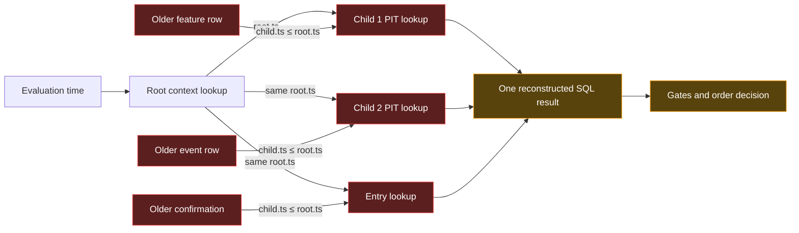
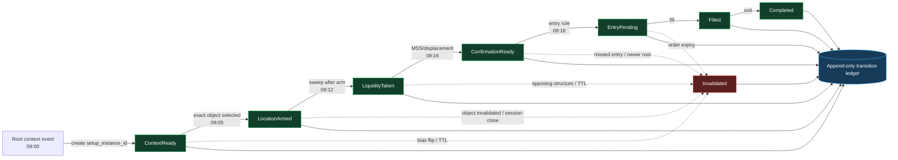
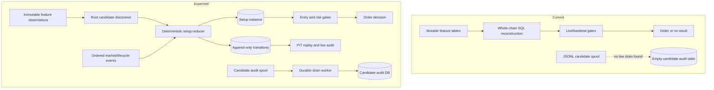
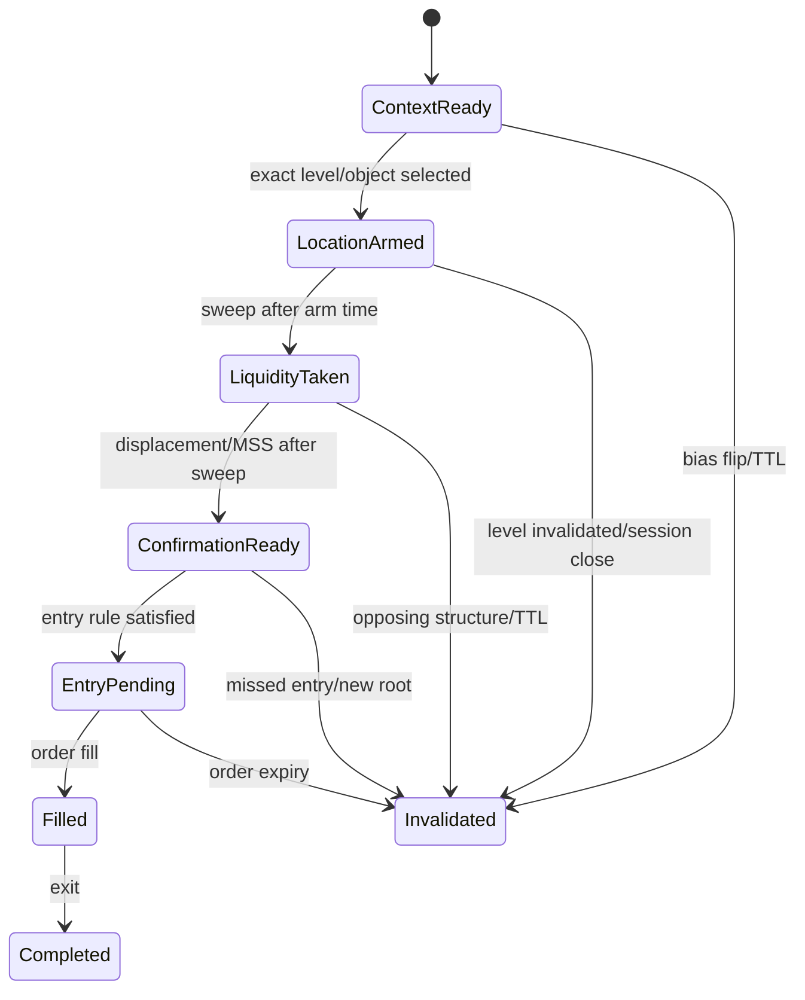

# Progressive State Architecture Deep Audit — 2026-07-23

## Scope

Read-only audit of progressive strategy compiler, YAML contract, live analyzer, PIT backtester, setup lifecycle, candidate audit, pipeline health, feature/lifecycle ledgers, migrations, tests, and current DB state.

Backtest slippage, spread, commissions, and transaction costs intentionally excluded from findings and recommendations, per request. Findings concern signal causality, setup identity, lifecycle, data truth, and live/backtest parity.

## Executive verdict

System is **not yet a true progressive setup-state engine**.

Current `steps[]` compiler builds one SQL query made of point-in-time lookups. It does not persist a setup instance, advance that instance through ordered states, or cancel it when its original context fails. Worse, current child-step time relation points backward from parent time, not forward after parent formation. Child timestamp is then discarded as next-step anchor. This defeats central migration goal.

Architecture has useful foundations: DAG validation, PIT/live compiler modes, lifecycle-aware feature registry, immutable strategy snapshots, producer ledger, setup evaluation cache, staged reducer modules, signal fingerprinting, and passing compiler tests. But core progressive semantics remain wrong or incomplete.

### Release recommendation

**Do not promote progressive specs to live execution until P0 findings close.** Existing non-progressive strategies may continue under existing controls. Progressive variants should remain paper/shadow.

---

## Severity summary

| Severity | Count | Meaning |
|---|---:|---|
| P0 critical | 6 | Can invalidate progressive causality or make audit impossible |
| P1 high | 9 | Can create silent state loss, false health, or live/backtest divergence |
| P2 medium | 7 | Weakens maintainability, observability, and research validity |

---

# P0 findings

## P0-1 — Progressive time direction is reversed

**Evidence:** `packages/strategies/src/compiler.ts`, `buildProgressivePitLateral()`.

Generated child policy:

- `child.ts <= parent.ts`
- `child.ts >= parent.ts - lookback`

That selects feature existing **before or at parent timestamp**. Intended progressive rule described by architecture plan is child forming **after** parent:

- `child.ts >= parent.ts`
- `child.ts <= parent.ts + bounded window`

Example intended sequence: bias established, then location/zone selected, then sweep occurs, then displacement/structure confirms entry. Current query instead asks for latest child feature already present at bias timestamp.

**Trading impact:** old/noisy context can still become trading angle. Sequence can be logically impossible: sweep or confirmation may precede setup anchor.

**Fix:** stop treating every step as a backward PIT lookup. Give each step explicit temporal relation:

- `as_of`: state valid at parent time
- `after`: event forms after parent time
- `touch_after`: price touches parent object after creation
- `within`: event occurs within bounded interval after parent

Default dependent event steps to `after`. Keep contextual state steps explicit `as_of`.

## P0-2 — Child timestamp is discarded, so chain never advances

**Evidence:** child CTE in `packages/strategies/src/compiler.ts` projects:

- `${parentAlias}.ts` as CTE `ts`
- `pit_child.ts AS child_ts`

Next child anchors to `${parentAlias}.ts`, which remains inherited root timestamp. It does not anchor to prior child event timestamp.

A chain `bias → zone → sweep → displacement` therefore evaluates zone, sweep, and displacement around root time rather than advancing clock through sequence.

**Trading impact:** YAML looks sequential while SQL remains root-anchored. Reviewers can approve false causality because syntax and runtime semantics disagree.

**Fix:** each CTE needs at least:

- `setup_started_at`
- `state_entered_at`
- `event_ts`
- `anchor_ts` used by descendants

For `after` steps, descendant `anchor_ts = child.ts`. For `as_of` context, preserve parent anchor intentionally.

## P0-3 — Compiler accepts DAG, runtime uses only first parent

**Evidence:** `packages/strategies/src/compiler.ts` reads `parentIds[0]`. Remaining `dependsOn` entries are ignored during SQL generation. Validator accepts arrays and checks only existence/cycles/reachability.

**Trading impact:** spec saying `dependsOn: [bias, zone, sweep]` does not enforce all parents. Strategy can trade without declared confluence.

**Fix:** either:

1. restrict schema to exactly one parent until multi-parent semantics exist; or
2. join every parent and require compatible `setup_instance_id`, symbol, direction, and temporal windows.

Seed-time validation must reject `dependsOn.length > 1` under current compiler.

## P0-4 — No durable progressive setup instance

**Evidence:** DB has `setup_evaluations`, but current rows are evaluation snapshots/cache records. No canonical table owns progressive identity and transitions. `setup_evaluations` has status columns from migration 118, but current DB shows:

- 3,184 rows
- 1,797 `blocked`
- 1,365 `waiting`
- 22 null status/hash legacy rows
- 0 rows with `invalidated_at`
- no `candidate`, `triggered`, `filled`, `completed`, or `invalidated` rows

No row ties exact step outputs into durable ordered state history.

**Trading impact:** every run can reconstruct different context from latest DB rows. Restart loses in-flight sequence. Same market setup can fork into multiple unrelated evaluations. Cancellation cannot target original setup.

**Fix:** add canonical tables:

### `strategy_setup_instance`

- `setup_instance_id`
- `strategy_snapshot_id` / `compiled_snapshot_id`
- `strategy_id`, `symbol`, `side`
- `root_feature_identity`
- `started_at`, `current_state`, `state_entered_at`
- `expires_at`, `invalidated_at`, `invalidation_reason`
- `version`, `created_at`, `updated_at`

### `strategy_setup_transition`

- `setup_instance_id`
- `from_state`, `to_state`
- `event_ts`, `observed_at`
- `feature_table`, `feature_identity`
- immutable feature snapshot/hash
- rejection/cancellation reason
- unique transition fingerprint

Transitions should be append-only. Current state should update under optimistic version or row lock.

## P0-5 — Candidate audit table is empty; live spool has no wired drain

**Evidence:** current `strategy_signal_candidates` row count is 0. `packages/tradePipeline/src/liveRunner.ts` appends JSONL records through `candidateAudit.ts`. Search found no live call to `drainSpool()`. Drain exists in `scripts/candidate-audit-spool.js`, used by backtest and ORB shadow script, not live runner.

**Trading impact:** system cannot answer why live strategy had no trade, which progressive step failed, or whether accepted/rejected decisions used expected feature objects. Audit contract promised by migration 114 is not operating.

**Fix:** add dedicated PM2 drain worker or ingestion-style drain loop. Expose spool bytes/files/oldest age in health endpoint. Never delete spool before successful transaction. Quarantine malformed lines. Alert when oldest record exceeds 5 minutes.

## P0-6 — Feature producers are actively failing across live universe

**Evidence:** `feature_producer_runs` over last seven days shows repeated `output_anchor_stale` errors for `features_bias`, `features_htf_bias`, and `features_atr` at `1h` across XAUUSD, USDSEK, USDJPY, USDCHF, USDCAD, NZDUSD, GBPUSD, EURUSD, and AUDUSD. Latest failures occurred around 2026-07-23 05:37–05:48 UTC. `features_bollinger`/`features_keltner` also show `output_anchor_missing` on 4h/1d.

24-hour ledger totals:

- 11,874,668 `done` run rows
- 89,289 `error` run rows

Run-row count itself is abnormally high and suggests ledger amplification or backfill activity; health must distinguish live cadence from historical recompute.

**Trading impact:** progressive root state can stall while lower steps continue changing. Setup chains then use old bias or block unpredictably. Backtests may use repaired history while live analyzer sees broken edge state.

**Fix:** hard readiness gate per required `(feature, symbol, tf)` using data-clock watermark, not wall clock. Progressive setup creation must stop when root/context producer fails. Separate live producer runs from backfill/recompute in ledger and health aggregation.

---

# P1 findings

## P1-1 — `rankLimit` and `rankOrderBy` validate but do nothing

Types and validator expose rank configuration. Compiler never applies `ROW_NUMBER()` or rank limit.

**Impact:** spec author may expect highest-quality zone/object, but compiler chooses registry `DISTINCT ON` latest row. This can select lower-quality noise.

**Fix:** implement deterministic ranking or reject rank fields until implemented. Tests must prove selected feature identity, not SQL string presence only.

## P1-2 — Root selection assumes first root; multiple roots are unsafe

Validator requires at least one root, not exactly one. Compiler chooses first root for bias alias. Topological terminal/reachability logic may reject some fan-out shapes, but multiple-root semantics remain unclear.

**Impact:** root order in YAML can change strategy meaning. Independent context branches cannot be reconciled safely.

**Fix:** require exactly one root for current linear model. Later add explicit join node for multi-root convergence.

## P1-3 — Entry `dependsOn` is validated but ignored

Entry conditions can carry `dependsOn`, yet compiler anchors all entries to last topological step. Declared entry parent does not control runtime.

**Impact:** YAML contract lies. Entry confirmation may attach to wrong branch or timestamp.

**Fix:** compile each entry against declared parent. Require `dependsOn` for progressive entry conditions. Reject missing or multi-parent entry dependency until supported.

## P1-4 — Progressive model is SQL reconstruction, not event-driven lifecycle

Current compiler executes complete chain per query. No transition engine waits for next event while retaining original object identities. Staged planner/reducer modules exist and pass tests, but progressive `steps[]` path does not use durable reducer state.

**Impact:** repeated scans can choose different zone/sweep on each bar. “One setup, one story” guarantee absent.

**Fix:** unify `steps[]` with reducer architecture. SQL should discover candidate events; reducer should own state transition and cancellation.

## P1-5 — Setup invalidation column unused

Migration 118 adds `invalidated_at`; current DB has zero invalidated rows. No proven refresh function transitions waiting/candidate setup rows when bias flips, zone invalidates, TTL expires, session closes, or order becomes impossible.

**Impact:** stale setup lifecycle remains theoretical.

**Fix:** explicit cancellation policy per strategy and periodic/event-triggered invalidation worker. Required cancellation reasons:

- bias flip
- parent object invalidated
- opposing structure break
- session close
- TTL expiration
- entry missed/price ran away
- newer root supersedes old root
- one-trade-per-setup consumed

## P1-6 — Live feature compute skips DB lifecycle refresh

`apps/web/src/lib/pipelineTrigger.ts` runs DAG with `skipLifecycle: true`; comments delegate older rows to periodic back-office refresh. Existing project notes state lifecycle cron has reliability/convergence concerns.

**Impact:** live mode trusts stored lifecycle (`trustStoredLifecycle: true`) while hot path intentionally does not refresh full stored lifecycle. Progressive selection can trust stale `is_fresh`/`invalidated_at`.

**Fix:** bounded lifecycle service must be healthy before live trust. For setup-owned objects, reducer should consume immutable lifecycle events rather than mutable wall-clock flags.

## P1-7 — Pipeline health view produces duplicate historical-looking rows

Current `pipeline_health` output returned many rows for same `(AUDUSD, pro_ltf_scalp_eurusd_v1)` with different `last_pipeline_run` values. Migration 120 joins `pipeline_trigger_state` only on symbol. Actual trigger table evidently contains more than one row per symbol or schema evolved beyond view assumptions.

**Impact:** dashboards show many stale rows plus one healthy row for same pair/variant. Alerting becomes noisy and operators can miss true outage.

**Fix:** make view join exact current trigger identity or aggregate `MAX(updated_at)` by symbol before join. Add uniqueness constraint matching intended key. Include expected cadence and market-calendar state.

## P1-8 — Live audit records only final signal, not failed progressive steps

`appendSignalCandidate()` occurs after signal exists and gates/order decision finish. If compiled SQL yields no signal because step 2 or 3 fails, no candidate row is written.

**Impact:** most important “why no setup?” path remains invisible. Empty candidate table cannot distinguish no root, no zone, no sweep, stale data, SQL error, or audit failure.

**Fix:** emit step-evaluation transition/audit rows before final signal. At minimum record one evaluation summary per `(strategy, symbol, evaluation_ts)` with first failed step and matched feature identities.

## P1-9 — Progressive adoption remains partial and DB/YAML can diverge

DB query found 75 strategy families but only five family base specs with non-empty `steps` before variant merge analysis. Repo contains more progressive YAML files. Prior incidents show backtest loads merged DB family+variant spec, not YAML.

**Impact:** code review of YAML may not describe live/backtest spec. Architecture migration status is unclear.

**Fix:** generate signed manifest at seed time containing YAML hash, merged DB hash, compiler hash, active status, and progressive/legacy mode. CI and deployment should fail on drift.

---

# P2 findings

## P2-1 — Tests validate SQL text, not temporal truth

Strategy suite passes: 96 tests across seven files. Progressive compiler tests check strings such as `child.ts <= parent.ts` and parent anchoring, which currently encode wrong progressive direction.

**Fix:** fixture-based temporal tests with deliberately adversarial rows:

- child before parent must fail for `after`
- child after parent must pass
- event after TTL must fail
- invalidated parent before child must fail
- second setup cannot consume first setup's event
- future lifecycle mutation cannot change PIT result

## P2-2 — No transition conservation invariants

Missing checks such as:

- one active instance per root identity/strategy/side
- every non-root transition has valid previous state
- terminal instance cannot transition again
- one filled order maps to one setup instance
- one transition fingerprint appears once

**Fix:** DB constraints plus reconciliation job.

## P2-3 — Setup cache identity lacks explicit strategy identity in visible lifecycle design

`context_hash` dedup is useful, but lifecycle table is generic and setup identity should include strategy snapshot/compiler version. Otherwise identical context under changed rules can be reused incorrectly unless hash construction always includes all versions.

**Fix:** persist `strategy_id`, `strategy_snapshot_id`, `compiled_snapshot_id`, `setup_instance_id`, and `evaluation_contract_version` as columns, not only nested evidence/hash input.

## P2-4 — Mutable feature rows remain dangerous setup references

Lifecycle tables update `is_fresh`, fill, touches, invalidation fields. A setup reconstructed later from mutable row can differ from original observation.

**Fix:** setup transition stores immutable feature snapshot and logical identity. PIT replay reads effective-time event history, not present mutable row.

## P2-5 — Structure freshness uses global fallback

Progressive compiler adds default 30-minute structure freshness near final anchor. This is generic, not step-specific, and can conflict with declared lookback/TTL.

**Fix:** remove hidden strategy semantics. Require step temporal policy in spec and validate against timeframe.

## P2-6 — Direction auto-alignment assumes every child direction has same semantics

`pit_child.direction = parent.direction` is automatic unless disabled. Sweep direction, zone direction, displacement direction, bias direction, and liquidity-taken side may not share identical semantic orientation.

**Fix:** feature registry must declare direction semantics and allowed mappings. Example: buy-side liquidity sweep may precede bearish reversal, so equality can be wrong.

## P2-7 — Health uses wall-clock thresholds where data clock is required

Lifecycle query showed many entries around 25.3 hours stale, including sparse event features and state features. Some may reflect market/calendar cadence; some are true stalls. Raw `NOW() - last_processed_ts` mixes both.

**Fix:** calculate freshness against latest tradable canonical candle per symbol/tf. Event features use producer-run watermark, not feature `MAX(ts)`.

---

# Live versus backtest parity assessment

## Shared pieces

- Both use `compileStrategy()`.
- Live immutable deployment stores PIT SQL snapshot.
- Backtester loads merged DB spec.
- PIT mode strips mutable lifecycle fields and recomputes lifecycle semantics.
- Strategy compiler/validator tests pass.

## Material divergence

| Area | Live | Backtest | Risk |
|---|---|---|---|
| Lifecycle | trusts stored mutable lifecycle | strips/recomputes PIT lifecycle | correct by design only if live lifecycle service healthy |
| Setup state | reconstructed query each evaluation | reconstructed query over window | neither owns durable progressive instance |
| Setup engine | normal live gates | can use strict/lenient/skip; generic source skips | result can differ by runner mode |
| Candidate audit | final signal appended to undrained spool | script has drain helper | live evidence absent |
| Producer edge | current failed producers can block/stale | repaired historical DB may be dense | optimistic backtest, broken live edge |
| Temporal chain | backward/root-anchored | same compiler bug | shared wrong logic is parity, not correctness |

Parity alone is insufficient. Both paths can agree on wrong temporal semantics.

---

# Trading-model gaps

Ignoring slippage, spread, and transaction costs as requested, strategy engine still needs these market-logic controls:

1. **Setup ownership:** one root market idea owns all later evidence.
2. **Sequence direction:** context may be as-of; triggers must occur after prior state.
3. **Object identity:** exact zone/OB/FVG/sweep IDs carried through chain.
4. **Cancellation:** bias flip, invalidation, opposing break, expiry, session close.
5. **No evidence recycling:** event consumed by one setup cannot confirm unrelated newer setup unless spec allows sharing.
6. **No cross-cycle contamination:** new root context supersedes or forks explicitly.
7. **State dwell/timeout:** maximum bars in each state, not one global query lookback.
8. **Missed-entry state:** price departure should expire setup rather than let old confirmation linger.
9. **Direction semantics:** liquidity side and trade direction mapped explicitly.
10. **Setup quality frozen at decision time:** later lifecycle changes cannot rewrite historical checklist.

---

# Before-and-after graphical representation

## Before — current snapshot reconstruction



Current behavior:

- Every child searches backward from root timestamp.
- Child event time does not become next anchor.
- Only first declared parent controls child lookup.
- Query reconstructs setup on every evaluation.
- No durable setup identity or transition history exists.
- Restart or later feature mutation can change selected context.

### Current temporal example

```mermaid
timeline
    title Current compiler can bind events in wrong order
    08:45 : Historical sweep
    08:50 : Historical displacement
    09:00 : Root bias selected
    09:05 : Strategy evaluation reconstructs all steps around 09:00 root
    09:10 : Signal may pass despite trigger events preceding root
```

## After — expected progressive setup lifecycle



Expected behavior:

- Root event creates one durable setup instance.
- Each event must occur after required parent state.
- Accepted child timestamp advances setup clock.
- Every declared dependency is enforced.
- Exact feature/object identities remain attached to setup.
- Invalidations create terminal, auditable transitions.
- Restart resumes same setup without rebuilding its history.

### Expected temporal example

```mermaid
timeline
    title Expected causal sequence
    09:00 : Bias establishes root setup
    09:05 : Exact zone arms setup
    09:12 : Liquidity sweep occurs after zone arm
    09:16 : Displacement and MSS confirm after sweep
    09:18 : Entry becomes eligible
    09:20 : Fill or explicit expiry
```

## Runtime architecture comparison



## Target state machine



## Runtime split

1. **Feature producers:** immutable observations plus lifecycle event ledger.
2. **Candidate discoverer:** finds new root events only.
3. **Setup reducer:** deterministic `(state, event) => newState`.
4. **Transition store:** append-only evidence and state history.
5. **Order decision:** reads one `ConfirmationReady` instance.
6. **Replay engine:** feeds same ordered events through same reducer for backtest.

Backtest should not compile a whole setup into one historical SQL join. It should replay events through same reducer used live. SQL may prefetch ordered event streams for speed.

---

# Required fix order

## Phase 1 — Contain risk

1. Keep all `steps[]` variants paper/shadow.
2. Gate live setup creation on required producer watermarks.
3. Wire candidate spool drain and spool health.
4. Fix `pipeline_health` duplicate join.
5. Reject multi-parent steps, multiple roots, entry without one explicit parent, and rank fields until compiler supports them.

## Phase 2 — Correct semantics

1. Add explicit temporal relation to every progressive step.
2. Advance anchor timestamp through event steps.
3. Carry feature logical identity and all required columns through CTE/reducer.
4. Add adversarial DB-backed temporal tests.
5. Make direction alignment semantic, registry-driven.

## Phase 3 — Durable state

1. Add setup instance and transition tables.
2. Implement idempotent reducer with optimistic locking/advisory key.
3. Add invalidation worker and transition reconciliation.
4. Store immutable step snapshots and compiled strategy provenance.

## Phase 4 — Unified replay

1. Live consumes canonical ordered events.
2. Backtest replays same events through same reducer.
3. Compare live shadow transitions against replay by fingerprint.
4. Promotion gate requires zero unexplained transition divergence.

---

# Acceptance gates before live promotion

- [ ] Child event before parent never advances setup.
- [ ] Child event after parent advances exact setup once.
- [ ] Next step anchors to prior child timestamp where relation is sequential.
- [ ] Every declared dependency enforced.
- [ ] Every active setup has immutable root and feature identities.
- [ ] Bias flip and object invalidation produce terminal transition.
- [ ] Restart resumes same in-flight setup without duplicate transition/order.
- [ ] Live candidate/transition audit DB lag under five minutes.
- [ ] No required live producer has stale/missing watermark.
- [ ] Pipeline health returns one row per active `(symbol, variant)`.
- [ ] PIT replay and live shadow produce same transition fingerprints.
- [ ] Future mutation of lifecycle columns does not change historical replay.
- [ ] Rank configuration either works deterministically or is rejected.
- [ ] YAML hash, merged DB spec hash, compiler hash, and deployed snapshot match.

---

# Verification performed

- Read progressive compiler and validator.
- Read live pipeline compile/snapshot path.
- Read live candidate audit writer and spool drain script.
- Read setup lifecycle and candidate audit migrations.
- Read setup evaluation persistence helpers.
- Read pipeline health view.
- Read backtester progressive normalization and setup evaluation path references.
- Queried current PostgreSQL schema and operational tables.
- Ran `pnpm --filter @tm/strategies test`: **7 test files passed, 96 tests passed**.

Passing tests confirm current implementation stability, not progressive temporal correctness. Existing tests explicitly expect backward point-in-time lookup behavior.

## Final assessment

Core problem remains architectural, not strategy tuning. `steps[]` currently expresses progressive intent but executes snapshot reconstruction. Highest-value fix is durable setup reducer with explicit temporal relations and immutable object identity. Until then, system can still recycle old context, bind events to wrong setup cycle, and provide no durable proof of how checklist advanced.
